\# Práctica 2.1: Despliegue de WordPress con MariaDB ### Descripción \*\*Actividad:\*\* \*Despliegue de WordPress con MariaDB\*

En esta práctica desplegarás un \*\*CMS (Sistema de Gestión de Contenidos)\*\* completo utilizando WordPress, una de las plataformas más populares para la creación de sitios web. Este despliegue requiere la integración de dos contenedores: un servidor web con WordPress y una base de datos MariaDB.

\#### Objetivo general

Aprender a:

- Desplegar aplicaciones web complejas con dependencias de base de datos.
- Integrar múltiples servicios mediante redes Docker.
- Gestionar persistencia de datos tanto de la aplicación como de la base de datos.
- Configurar aplicaciones mediante múltiples variables de entorno.
- Comprender el ciclo de vida de aplicaciones con estado y base de datos.
- Trabajar con volúmenes para datos críticos.

\---

\### Contexto de trabajo

\*\*WordPress\*\* es un CMS de código abierto que permite crear y gestionar sitios web de forma sencilla. Para su funcionamiento requiere:

\*\*Componentes de la arquitectura:\*\*

1. \*\*Servidor Web + WordPress:\*\*
- Servidor web Apache con PHP y WordPress instalado.
- Escucha en el puerto 80/tcp.
- Almacena contenido en `/var/www/html/wp-content`.
- Imagen Docker: `wordpress`
2. \*\*Base de datos MariaDB:\*\*
- Sistema de gestión de base de datos relacional.
- Escucha en el puerto 3306/tcp.
- Almacena datos en `/var/lib/mysql`.
- Imagen Docker: `mariadb`

\*\*Características importantes:\*\*

- WordPress necesita conectarse a la base de datos para almacenar contenido, usuarios, configuraciones, etc.
- Ambos servicios requieren persistencia de datos mediante volúmenes.
- La comunicación entre servicios se realiza mediante red Docker interna.

\---

\### 🔹 Parte 1: Despliegue básico de WordPress

\#### Tarea 1.1: Preparación del entorno

1. Crea una red Docker personalizada llamada `red\_wp` para la comunicación entre los contenedores.

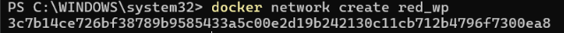

2. Crea los directorios en el host para la persistencia de datos:
- `/opt/mysql\_wp` - Para los datos de MariaDB

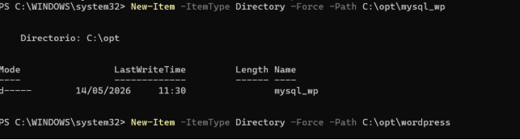

- `/opt/wordpress` - Para el contenido de WordPress

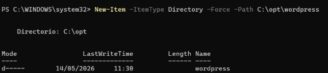

3. Investiga en Docker Hub la documentación de las imágenes:
- `mariadb` - Identifica las variables de entorno necesarias MARIADB\_RANDOM\_ROOT\_PASSWORD MARIADB\_ROOT\_PASSWORD\_HASH, MARIADB\_ROOT\_PASSWORD
- `wordpress` - Identifica las variables de entorno de configuración -e WORDPRESS\_DB\_HOST

  -e WORDPRESS\_DB\_USER

  -e WORDPRESS\_DB\_PASSWORD

  -e WORDPRESS\_DB\_NAME

  #### Tarea 1.2: Despliegue del contenedor de base de datos

1. Despliega el contenedor de MariaDB con las siguientes características:

- Nombre del contenedor: `servidor\_mysql`
- Conectado a la red `red\_wp`
- Volumen montado desde `/opt/mysql\_wp` del host a `/var/lib/mysql` del contenedor
- Variables de entorno necesarias:
  - Nombre de la base de datos: `bd\_wp`
  - Usuario de la base de datos: `user\_wp`
  - Contraseña del usuario: (elige una segura)
  - Contraseña del usuario root: (elige una segura)
- Ejecutando en modo daemon

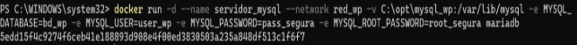

2. Verifica que el contenedor está en ejecución.

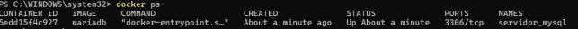

3. Inspecciona los logs del contenedor para ver el proceso de inicialización de la base de datos.

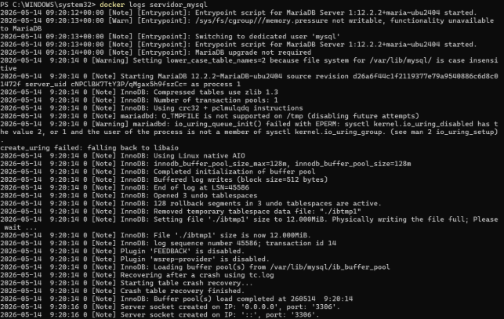

\#### Tarea 1.3: Despliegue del contenedor de WordPress

1. Despliega el contenedor de WordPress con las siguientes características:
- Nombre del contenedor: `servidor\_wp`
- Conectado a la red `red\_wp`
- Volumen montado desde `/opt/wordpress` del host a `/var/www/html/wp-content` del 

contenedor

- Puerto 80 del host mapeado al puerto 80 del contenedor

- Variables de entorno necesarias:
  - Host de la base de datos: (nombre del contenedor de MariaDB)
  - Usuario de la base de datos
  - Contraseña de la base de datos
  - Nombre de la base de datos
- Ejecutando en modo daemon

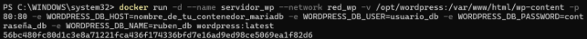

2. Verifica que el contenedor está en ejecución.

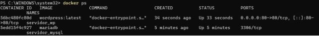

3. Accede a WordPress desde tu navegador (http://localhost). #### Tarea 1.4: Instalación y configuración de WordPress
1. Completa la instalación de WordPress desde el navegador:
- Título del sitio
- Usuario administrador
- Contraseña del administrador
- Correo electrónico

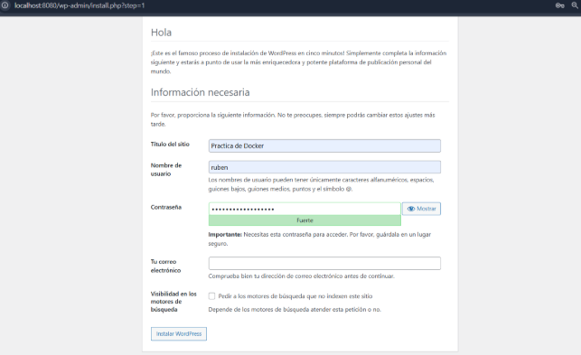

2. Accede al panel de administración de WordPress.

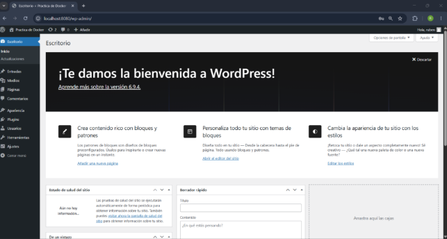

3. Crea al menos:
- 2 páginas

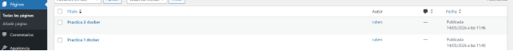

- 3 entradas (posts)

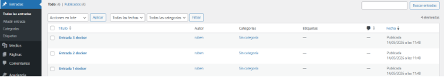

- 1 categoría personalizada

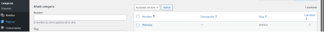

4. Instala y activa un tema diferente al predeterminado.

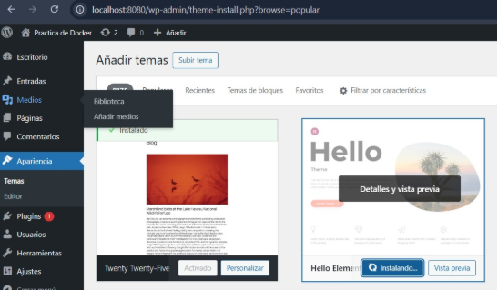

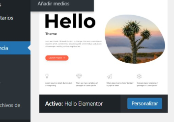

5. Instala al menos un plugin.

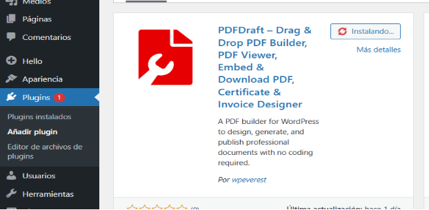

\---

\### 🔹 Parte 2: Verificación de la persistencia

\#### Tarea 2.1: Persistencia de WordPress

1. Detén y elimina el contenedor `servidor\_wp` (NO elimines el volumen).

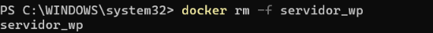

2. Verifica el contenido del directorio `/opt/wordpress` en el host.

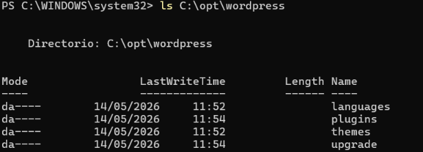

3. Vuelve a crear el contenedor `servidor\_wp` con la misma configuración.

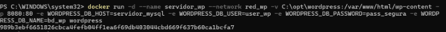

4. Accede a WordPress y verifica que:
- Todo el contenido creado sigue presente

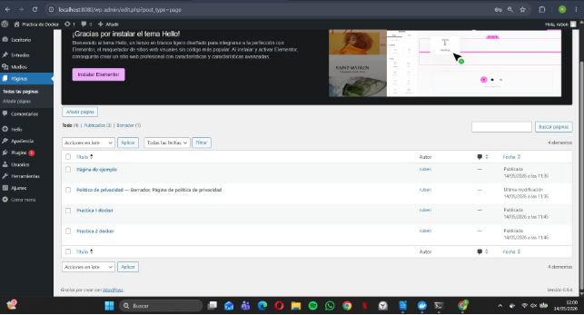

- El tema instalado sigue activo

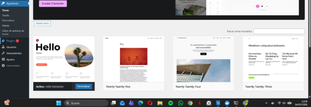

- Los plugins siguen instalados

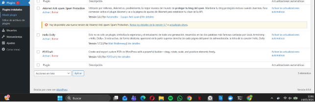

\#### Tarea 2.2: Persistencia de la base de datos

1. Detén y elimina ambos contenedores (NO elimines los volúmenes).

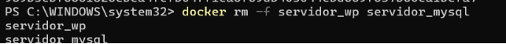

2. Verifica el contenido del directorio `/opt/mysql\_wp` en el host.

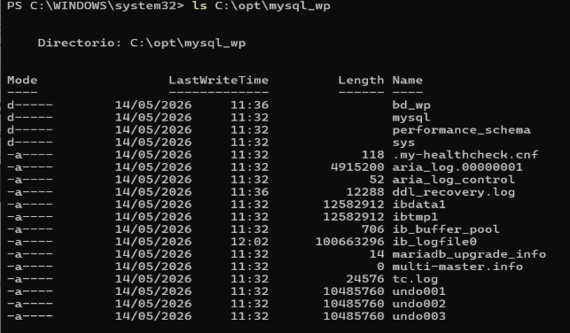

3. Vuelve a crear ambos contenedores con la misma configuración.

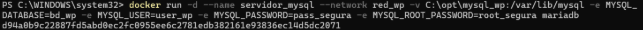

4. Accede a WordPress y verifica que toda la información se mantiene.

   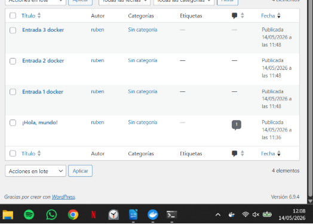

\---

\### 🔹 Parte 3: Análisis de la arquitectura

\#### Tarea 3.1: Comunicación entre contenedores

1. Desde el contenedor de WordPress, verifica la conectividad con la base de datos:
- Realiza un ping al contenedor de MariaDB

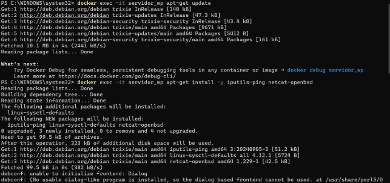

- Verifica que se puede resolver el nombre del contenedor de base de datos

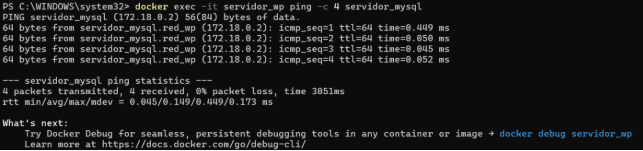

2. Intenta acceder al puerto 3306 del contenedor de MariaDB desde el contenedor de WordPress.

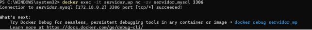

3. Reflexiona sobre por qué WordPress puede acceder a MariaDB sin que este último tenga puertos expuestos al host.

   Al ponerles a los dos el parámetro --network red\_wp cuando los creamos los metimos en la misma red privada tipo bridge., Por esto Docker les da total libertad para comunicarse entre ellos dentro de esa misma red todos los puertos internos de un contenedor están completamente abiertos.

   #### Tarea 3.2: Variables de entorno y configuración automática

1. Inspecciona el archivo `wp-config.php` dentro del contenedor de WordPress.
1. Verifica que las credenciales de la base de datos coinciden con las variables de entorno que definiste.

   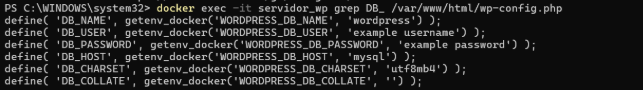

3. Investiga qué hace el script `docker-entrypoint.sh` en ambos contenedores.
1. **¿Qué hace en el contenedor de MariaDB?**
- Cuando arranca, el script mira si la carpeta de datos (/var/lib/mysql) está vacía.
- Si está vacía inicializa las tablas del sistema.
- Luego, lee las variables de entorno que le pasaste (MYSQL\_DATABASE, MYSQL\_USER, MYSQL\_PASSWORD).
- Entra a la base de datos crea esa base de datos y ese usuario automáticamente y le da todos los permisos.
- Finalmente arranca el motor de MariaDB para que empiece a aceptar conexiones.
2. **¿Qué hace en el contenedor de WordPress?**
- Cuando arranca, revisa si existe el archivo wp-config.php en la carpeta /var/www/html.
- Si no existe coge un archivo de plantilla wp-config-sample.php lee las variables de entorno que le pasaste WORDPRESS\_DB\_HOST, etc. y las inyecta creando el archivo wp- config.php .
- También ajusta los permisos de las carpetas para que puedas subir imágenes y plugins sin 

  problemas.

- Finalmente, arranca el servidor web Apache para que tu página esté visible.

\---

\### 🔹 Parte 4: Configuración avanzada

\#### Tarea 4.1: Cambio del nombre del servidor de base de datos

1. Elimina ambos contenedores (mantén la red y los volúmenes).

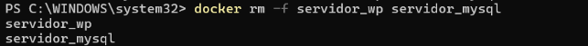

2. Crea el contenedor de MariaDB con un nombre diferente, por ejemplo `mariadb\_wordpress`.

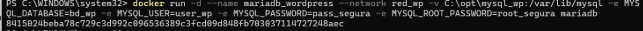

3. Modifica la configuración del contenedor de WordPress para que se conecte al nuevo nombre del servidor de base de datos.

   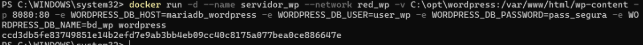

4. Verifica que WordPress funciona correctamente.

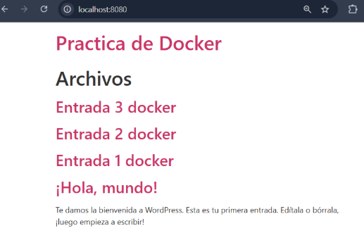

\#### Tarea 4.2: Exposición de la base de datos

1. Recrea el contenedor de MariaDB exponiendo su puerto 3306 al host (por ejemplo, en el puerto 3307).

   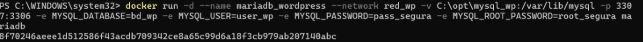

2. Utiliza un cliente de base de datos (MySQL Workbench, DBeaver, o `mysql` desde línea de comandos) para conectarte a la base de datos desde tu host.

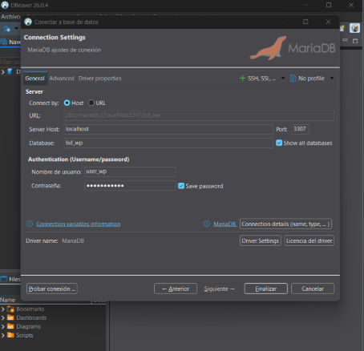

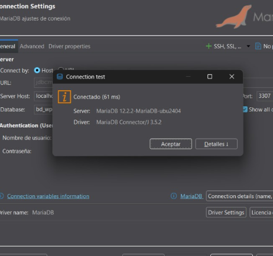

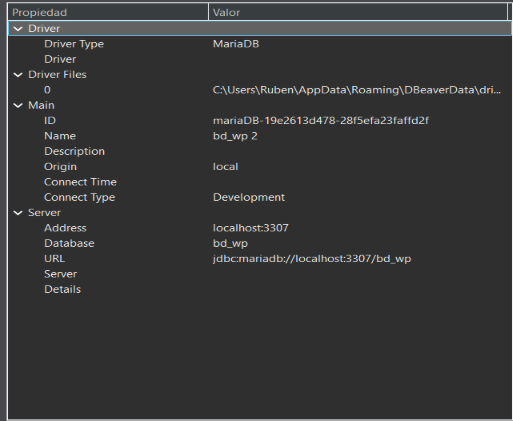

3. Explora las tablas creadas por WordPress.

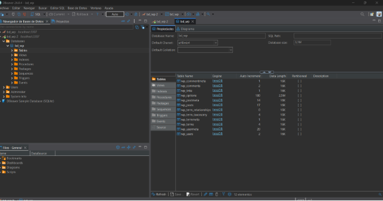

4. Identifica dónde se almacenan:
- Los posts/entradas
- Las páginas
- Los usuarios
- Las opciones de configuración

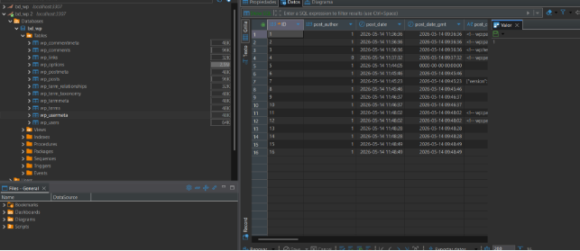

\---

\### 🔹 Parte 5: Análisis y documentación

\#### Tarea 5.1: Preguntas de análisis

Responde a las siguientes preguntas en tu documentación:

1. \*\*Arquitectura de la aplicación:\*\*
- ¿Por qué WordPress necesita una base de datos?

Porque necesita lugar para guardar todo el texto de las entradas, la información de los usuarios, las contraseñas, los comentarios y la configuración del sitio. Sin base de datos no habría forma de guardar y recuperar esta información.

- ¿Qué tipo de datos se almacenan en la base de datos vs. en el volumen de WordPress?
- **Base de datos:** Guarda *texto y relaciones* (el contenido de los posts, nombres de usuario, configuraciones, categorías).
- **Volumen de WordPress:** Guarda *archivos físicos* el código PHP de WordPress, los plugins 

  instalados, los temas de diseño y las imágenes/archivos que se suben a la biblioteca.

- ¿Cómo se comunican WordPress y MariaDB?

Se comunican a través de una red interna de Docker. WordPress usa el nombre del contenedor de la base de datos como si fuera una dirección IP  y se conecta internamente a través del puerto 3306. 

2. \*\*Persistencia de datos:\*\*
- ¿Qué pasaría si no usáramos volúmenes?

Que no se guardarían los datos, al apagar, borrar o actualizar los contenedores de Docker se perdería absolutamente todo. 

- ¿Por qué es crítico hacer backups de ambos volúmenes?

Porque si solo guardas la base de datos tendrás el texto pero perderás las imágenes y los temas. Si solo guardas el volumen de WordPress tendrás las imágenes pero perderás todo el texto de los artículos y los usuarios. 

- ¿Qué estrategias de backup recomendarías para un WordPress en producción?

Automatizar copias de seguridad diarias y guardarlas en servidores externos como Google Drive.

3. \*\*Seguridad:\*\*
- ¿Es necesario exponer el puerto de MariaDB al host? ¿Por qué?

No es necesario para que WordPress funcione. WordPress y MariaDB se hablan por la red interna de Docker. 

- ¿Qué riesgos de seguridad existen al exponer la base de datos?

Cualquiera que conozca la IP del servidor podría intentar conectarse a la base de datos y realizar ataques para adivinar la contraseña o aprovechar vulnerabilidades. 

- ¿Cómo mejorarías la seguridad de este despliegue?
- Quitando el mapeo de puertos de MariaDB. 
- Usando contraseñas mucho más seguras.
4. \*\*Scripts de inicialización:\*\*
- ¿Qué función cumple el `docker-entrypoint.sh` en MariaDB?

Se encarga de inicializar los archivos de la base de datos, establecer la contraseña del usuario root, crear la base de datos que le pedimos (bd\_wp) y crear nuestro usuario (user\_wp) dándole permisos. 

- ¿Qué función cumple el `docker-entrypoint.sh` en WordPress?

Comprueba si la carpeta de WordPress está vacía. Si lo está, descarga los archivos de WordPress. Luego, lee las variables de entorno que pusimos en el docker-compose.yml (usuario, contraseña, host) para preparar la conexión. 

- ¿En qué momento se crea el archivo `wp-config.php`?

Se crea automáticamente la primera vez que arranca el contenedor de WordPress 

5. \*\*Comparación con prácticas anteriores:\*\*
- ¿En qué se diferencia este despliegue de Guestbook?

Guestbook es una aplicación que normalmente usa bases de datos en memoria  para guardar mensajes simples. WordPress es un Sistema de Gestión de Contenidos completo, mucho más pesado, que requiere una base de datos relacional (MariaDB) y almacenamiento persistente para archivos multimedia. 

- ¿Cuál es más compleja de mantener y por qué?

WordPress  ya que requiere actualizaciones constantes del núcleo (core), de los plugins y del tema por motivos de seguridad. Además, hay que gestionar y hacer copias de seguridad de dos tipos de almacenamiento distintos. 

6. \*\*Escalabilidad y alta disponibilidad:\*\*
- ¿Se podría ejecutar múltiples instancias de WordPress conectadas a la misma base de datos?

Sí, se puede tener varios contenedores de WordPress apuntando a la misma MariaDB. Pero todos los contenedores de WordPress tendrían que compartir el mismo volumen. 

- ¿Cómo se podría implementar alta disponibilidad en la base de datos?

Se implementaría creando redundancia. En vez de usar un solo contenedor de MariaDB, se desplegarían varias instancias sincronizadas entre sí 

- ¿Qué limitaciones tiene este despliegue para un entorno de producción?
1. Es un Punto único de fallo: Si el contenedor de la base de datos se cae, toda la web se cae.
1. Las contraseñas están visibles en el archivo docker-compose.yml.

\#### Tarea 5.2: Comandos utilizados

Documenta todos los comandos Docker utilizados para:

- Crear la red y los directorios

**Crear la red :** docker network create red\_wp

**Crear los directorios :** New-Item -ItemType Directory -Force -Path C:\opt\mysql\_wp

`           `New-Item -ItemType Directory -Force -Path C:\opt\wordpress

- Desplegar y gestionar el contenedor de MariaDB

**Desplegar :** docker run -d --name servidor\_mysql --network red\_wp -v 

C:\opt\mysql\_wp:/var/lib/mysql -e MYSQL\_DATABASE=bd\_wp -e MYSQL\_USER=user\_wp -e MYSQL\_PASSWORD=pass\_segura -e MYSQL\_ROOT\_PASSWORD=root\_segura mariadb

**Verificación de ejecución:** docker ps

**Inspección de logs:** docker logs servidor\_mysql

- Desplegar y gestionar el contenedor de WordPress

**Desplegar :**docker run -d --name servidor\_wp --network red\_wp -v 

C:\opt\wordpress:/var/www/html/wp-content -p 8080:80 -e WORDPRESS\_DB\_HOST=servidor\_mysql -e WORDPRESS\_DB\_USER=user\_wp -e WORDPRESS\_DB\_PASSWORD=pass\_segura -e WORDPRESS\_DB\_NAME=bd\_wp wordpress

- Verificar logs y estado de los contenedores

**Verificar logs:** docker logs servidor\_wp

**Estado de los contenedores:**docker ps -a 

- Inspeccionar la configuración de red

**Inspeccionar la configuración de red:** docker network inspect red\_wordpress 

\---

\## Entregables

1\. \*\*Documentación en formato Markdown\*\* que incluya:

- Todos los comandos utilizados en cada tarea
- Capturas de pantalla que demuestren:
  - WordPress funcionando en el navegador
  - Panel de administración de WordPress
  - Contenido creado (páginas, posts, tema, plugins)
  - Lista de contenedores en ejecución
  - Inspección de la red Docker
  - Estructura de directorios de los volúmenes
  - Conexión a la base de datos y exploración de tablas
- Respuestas detalladas a todas las preguntas de análisis
- Comparación con las prácticas anteriores (Guestbook y Temperaturas)

\---

\### Evaluación

Se evaluará:

- La correcta implementación de la arquitectura completa.
- El funcionamiento de WordPress con todos sus componentes.
- La demostración de persistencia de datos en ambos servicios.
- La exploración de la base de datos.
- La profundidad del análisis técnico.
- La claridad y completitud de la documentación.
- La comparación crítica entre diferentes arquitecturas de aplicaciones.

\---

\### Condiciones de entrega

Las publicadas en la plataforma Moodle del curso. ---

\### Recursos de apoyo

- Documentación oficial de Docker: [https://docs.docker.com](https://docs.docker.com)
- Imagen MariaDB en Docker Hub: [https://hub.docker.com/\_/mariadb](https://hub.docker.com/\_/mariadb)
- Imagen WordPress en Docker Hub: [https://hub.docker.com/\_/wordpress](https://hub.docker.com/\_/wordpress)
- Documentación de WordPress: [https://wordpress.org/support/](https://wordpress.org/support/)
- Volúmenes en Docker: [https://docs.docker.com/storage/volumes/](https://docs.docker.com/ storage/volumes/)
- Docker Compose: [https://docs.docker.com/compose/](https://docs.docker.com/compose/)
- Variables de entorno en Docker: [https://docs.docker.com/engine/reference/commandline/run/#env](https://docs.docker.com/engine/ reference/commandline/run/#env)
