- Práctica 2.2 

\### Descripción

\*\*Actividad:\*\* \*Despliegue de Tomcat con Nginx - De la gestión manual a Docker Compose\*

Esta práctica integrada combina dos enfoques complementarios para desplegar una aplicación Java en un \*\*servidor de aplicaciones Tomcat\*\* con \*\*Nginx como proxy inverso\*\*. En la \*\*Primera Parte\*\* aprenderás a gestionar contenedores manualmente, entendiendo cada comando y configuración. En la \*\*Segunda Parte\*\* automatizarás todo el proceso usando \*\*Docker Compose\*\*, comprendiendo las ventajas de la orquestación declarativa.

Esta arquitectura de dos capas (servidor web + servidor de aplicaciones) es muy común en entornos de producción, ya que permite separar responsabilidades: Nginx maneja las peticiones HTTP, contenido estático y actúa como punto de entrada, mientras que Tomcat ejecuta la lógica de negocio de las aplicaciones Java.

\#### Objetivos generales

Aprender a:

- Desplegar aplicaciones Java en servidores de aplicaciones (Tomcat).
- Configurar Nginx como proxy inverso para enrutar peticiones.
- Utilizar bind mounts para montar archivos de configuración y aplicaciones.
- Comprender la arquitectura de múltiples capas en aplicaciones web.
- Trabajar con archivos WAR (Web Application Archive).
- Entender el flujo completo de peticiones en una arquitectura con proxy inverso.
- Gestionar contenedores Docker manualmente mediante comandos CLI.
- Automatizar y orquestar servicios con Docker Compose.
- Comparar ventajas y desventajas entre gestión manual y orquestación.
- Implementar configuraciones avanzadas: healthchecks, límites de recursos, redes personalizadas.

\---

\### Contexto de trabajo

En esta práctica trabajaremos con una arquitectura de dos capas que utiliza los siguientes componentes:

\*\*1. Servidor de aplicaciones Tomcat:\*\*

- Servidor de aplicaciones Java que ejecuta aplicaciones web empaquetadas en formato WAR.
- Escucha en el puerto 8080/tcp por defecto.
- Directorio de despliegue: `/usr/local/tomcat/webapps/`
- Imagen Docker: `tomcat:9.0`

\*\*2. Servidor web Nginx (Proxy inverso):\*\*

- Actúa como punto de entrada para las peticiones HTTP.
- Recibe peticiones en el puerto 80 y las redirige a Tomcat.
- Se configura mediante archivos de configuración en `/etc/nginx/conf.d/`
- Imagen Docker: `nginx`\
  \*\*Flujo de peticiones:\*\*

  ```

  Cliente → Nginx (puerto 80) → Tomcat (puerto 8080) → Aplicación Java ```

  \*\*Estructura de la práctica:\*\*

- \*\*PRIMERA PARTE (P2.4):\*\* Gestión manual con comandos Docker
- \*\*SEGUNDA PARTE (P2.8):\*\* Automatización con Docker Compose

\---

- PRIMERA PARTE: Gestión Manual con Docker

Esta primera parte se centra en comprender cada componente y comando Docker necesario para desplegar la arquitectura. Aprenderás a gestionar redes, contenedores, volúmenes y configuraciones de forma manual.

\---

\### 🔹 Parte 1: Preparación del entorno

\#### Tarea 1.1: Obtención de recursos

1. Crea un directorio de trabajo para esta práctica, por ejemplo `~/tomcat\_practica`.

   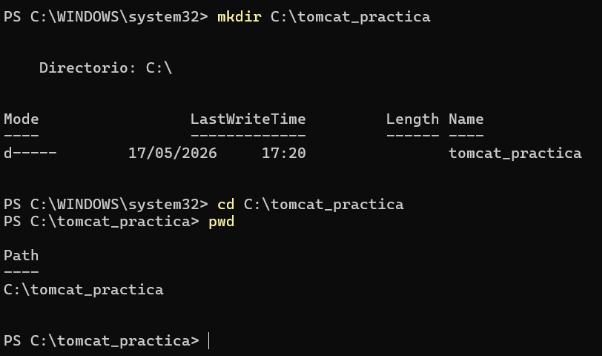

2. Descarga o crea un archivo WAR de ejemplo. Puedes:
- Descargar `sample.war` de la siguinete carpeta del repositorio: [recursos](./recursos/).
- En el README de la carpeta viene una explicación detallada de como trabajar con este 

archivo.

- Utilizar cualquier aplicación WAR simple que tengas disponible
- Crear una aplicación Java básica y empaquetarla como WAR

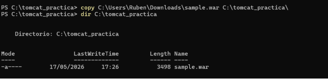

3. Investiga la estructura básica de un archivo de configuración de Nginx para proxy inverso.

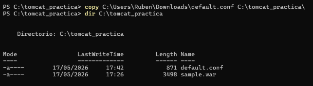

server {

`    `listen 80;

`    `server\_name localhost;

- Configuración del proxy para la aplicación sample

`    `location /sample/ {

`        `proxy\_pass http://NOMBRE\_CONTENEDOR\_TOMCAT:8080/sample/;

- Headers para el proxy

`        `proxy\_set\_header Host $host;

`        `proxy\_set\_header X-Real-IP $remote\_addr;

`        `proxy\_set\_header X-Forwarded-For $proxy\_add\_x\_forwarded\_for;         proxy\_set\_header X-Forwarded-Proto $scheme;

- Timeouts

`        `proxy\_connect\_timeout 60s;

`        `proxy\_send\_timeout 60s;

`        `proxy\_read\_timeout 60s;

`    `}

- Página de inicio por defecto de Nginx

`    `location / {

`        `root /usr/share/nginx/html;

`        `index index.html index.htm;

`    `}

- Gestión de páginas de error

`    `error\_page 500 502 503 504 /50x.html;

`    `location = /50x.html {

`        `root /usr/share/nginx/html;

`    `}

}

4. Crea un archivo de configuración de Nginx llamado `default.conf` que debe incluir:
- Servidor que escucha en el puerto 80
- Configuración de `location /` con proxy\_pass
- El proxy\_pass debe apuntar al contenedor de Tomcat (puerto 8080)
- Debe incluir el nombre de la aplicación en la ruta
- Gestión de páginas de error (500, 502, 503, 504)

\*\*Nota:\*\* Usa placeholders (como NOMBRE\_CONTENEDOR\_TOMCAT y NOMBRE\_APLICACION) que luego sustituirás por los valores reales.

server {

`    `listen 80;

`    `server\_name localhost;

- Configuración del proxy inverso hacia Tomcat

`    `location /NOMBRE\_APLICACION/ {

`        `proxy\_pass http://NOMBRE\_CONTENEDOR\_TOMCAT:8080/NOMBRE\_APLICACION/;

- Headers para mantener información de la petición original

`        `proxy\_set\_header Host $host;

`        `proxy\_set\_header X-Real-IP $remote\_addr;

`        `proxy\_set\_header X-Forwarded-For $proxy\_add\_x\_forwarded\_for;         proxy\_set\_header X-Forwarded-Proto $scheme;

- Timeouts

`        `proxy\_connect\_timeout 60s;

`        `proxy\_send\_timeout 60s;

`        `proxy\_read\_timeout 60s;

`    `}

- Página de inicio por defecto de Nginx

`    `location / {

`        `root /usr/share/nginx/html;

`        `index index.html index.htm;

`    `}

- Gestión de páginas de error

`    `error\_page 500 502 503 504 /50x.html;

`    `location = /50x.html {

`        `root /usr/share/nginx/html;

`    `}

}

5. Verifica que tienes ambos archivos:
- `sample.war` (o el nombre de tu aplicación WAR)
- `default.conf`

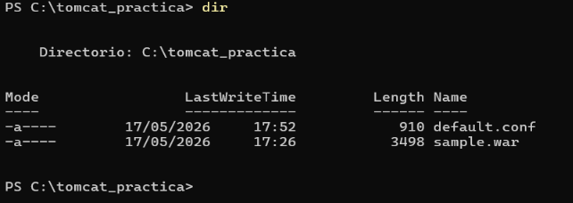

\#### Tarea 1.2: Creación de la red

1. Crea una red Docker personalizada llamada `red\_tomcat` para la comunicación entre los contenedores.

   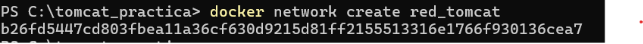

2. Verifica que la red se ha creado correctamente.

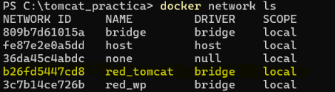

\---

\### 🔹 Parte 2: Despliegue del servidor Tomcat

\#### Tarea 2.1: Despliegue básico de Tomcat

1. Despliega un contenedor de Tomcat con las siguientes características:
   - Nombre del contenedor: `aplicacionjava`
   - Conectado a la red `red\_tomcat`
   - Bind mount del archivo WAR desde el host al directorio de despliegue de Tomcat
   - Montaje en modo solo lectura (`:ro`)
   - \*\*NO mapees puertos\*\* (el acceso será solo interno a través de Nginx)
- Ejecutando en modo daemon

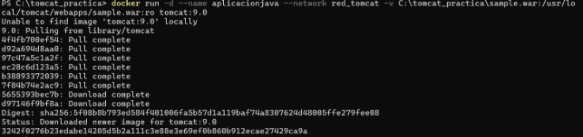

2. Verifica que el contenedor está en ejecución.

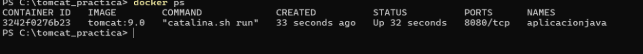

3. Inspecciona los logs del contenedor para verificar que la aplicación se ha desplegado correctamente.

   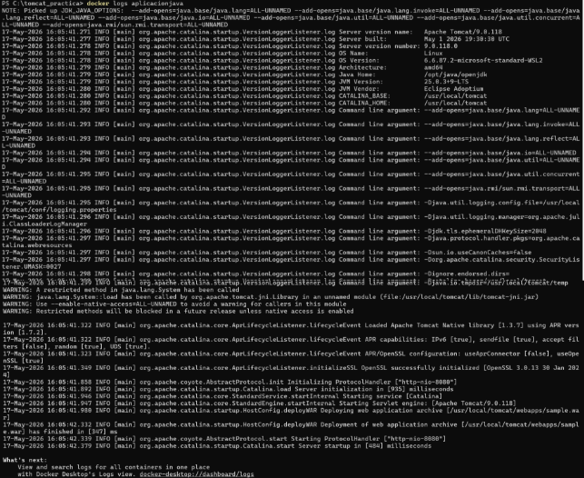

4. Accede al contenedor y verifica que el archivo WAR está en el directorio de despliegue.

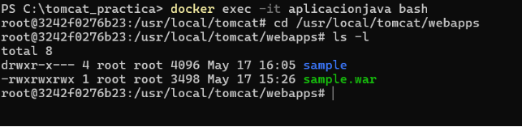

5. Comprueba que la aplicación se ha desplegado automáticamente (Tomcat descomprime el WAR).

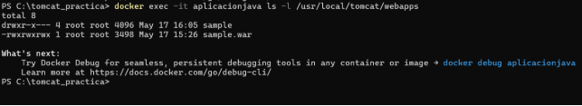

\---

\### 🔹 Parte 3: Configuración y despliegue de Nginx

\#### Tarea 3.1: Configuración del proxy inverso

1. Revisa y completa el archivo `default.conf` con la configuración correcta:
- Sustituye `NOMBRE\_CONTENEDOR\_TOMCAT` por el nombre real de tu contenedor de 

Tomcat

- Sustituye `NOMBRE\_APLICACION` por el nombre de tu aplicación (sin la extensión .war)
- Asegúrate de que la directiva `proxy\_pass` apunta correctamente

server {

`    `listen 80;

`    `server\_name localhost;

- Configuración del proxy inverso hacia Tomcat

`    `location /sample/ {

`        `proxy\_pass http://aplicacionjava:8080/sample/;

- Headers para mantener información de la petición original

`        `proxy\_set\_header Host $host;

`        `proxy\_set\_header X-Real-IP $remote\_addr;

`        `proxy\_set\_header X-Forwarded-For $proxy\_add\_x\_forwarded\_for;         proxy\_set\_header X-Forwarded-Proto $scheme;

- Timeouts

`        `proxy\_connect\_timeout 60s;

`        `proxy\_send\_timeout 60s;

`        `proxy\_read\_timeout 60s;

`    `}

- Página de inicio por defecto de Nginx

`    `location / {

`        `root /usr/share/nginx/html;

`        `index index.html index.htm;

`    `}

- Gestión de páginas de error

`    `error\_page 500 502 503 504 /50x.html;

`    `location = /50x.html {

`        `root /usr/share/nginx/html;

`    `}

}

2. Comprende qué hace cada directiva de la configuración:
- `listen`: Puerto en el que escucha Nginx
- `server\_name`: Nombre del servidor
- `location /`: Configuración del proxy inverso
- `proxy\_pass`: Dirección a la que se redirigen las peticiones

\#### Tarea 3.2: Despliegue de Nginx

1. Despliega un contenedor de Nginx con las siguientes características:
- Nombre del contenedor: `proxy`
- Puerto 80 del host mapeado al puerto 80 del contenedor
- Conectado a la red `red\_tomcat`
- Bind mount del archivo `default.conf` al directorio de configuración de Nginx
- Montaje en modo solo lectura (`:ro`)
- Ejecutando en modo daemon

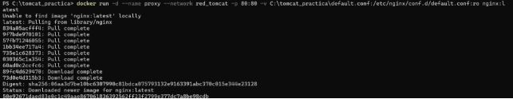

2. Verifica que el contenedor está en ejecución.

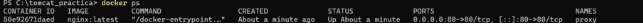

3. Inspecciona los logs de Nginx para verificar que no hay errores de configuración.

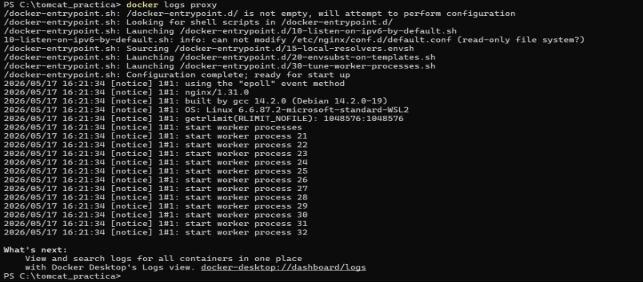

\#### Tarea 3.3: Verificación del despliegue

1. Accede a la aplicación desde tu navegador web (http://localhost).
1. Verifica que la aplicación Java se muestra correctamente.

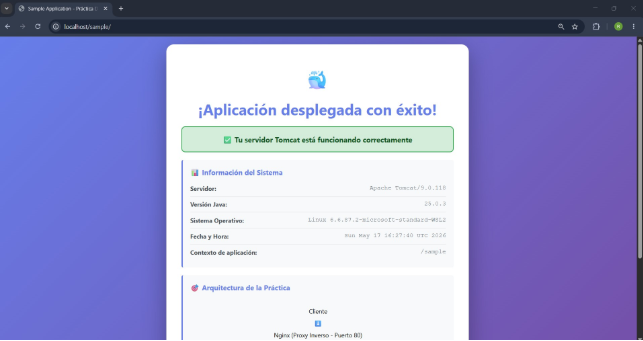

3. Comprueba que estás accediendo a través de Nginx (puerto 80) y no directamente a Tomcat.

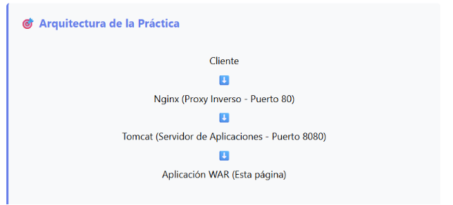

\---

\### 🔹 Parte 4: Análisis de la arquitectura

\#### Tarea 4.1: Flujo de peticiones

1. Analiza el flujo completo de una petición HTTP:
- ¿Qué componente recibe primero la petición del navegador?

`            `El primer componente que recibe la petición es Nginx. Nginx es el contenedor que tiene 

publicado el puerto 80. Como en la URL no pongo ningún puerto, el navegador usa por defecto el puerto 80. Por eso la petición entra primero por Nginx. 

- ¿Cómo sabe Nginx dónde redirigir la petición?

Nginx sabe a dónde tiene que enviar la petición porque se lo indicamos en su archivo de configuración, llamado default.conf. 

- ¿Por qué funciona la resolución del nombre del contenedor de Tomcat?

Funciona porque los dos contenedores están conectados a la misma red de Docker. Al estar en la misma red  Docker permite que un contenedor pueda encontrar al otro usando su nombre. Por eso Nginx puede usar el nombre aplicacionjava para comunicarse con Tomcat. 

- ¿Qué respuesta envía Tomcat de vuelta?

Tomcat devuelve la página de la aplicación Java que está desplegada. 

2. Realiza pruebas de conectividad:
- Desde el contenedor Nginx, intenta hacer ping al contenedor de Tomcat

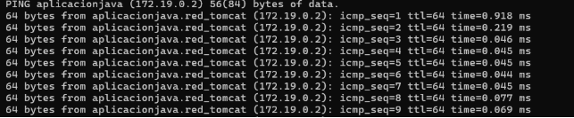

- Desde el contenedor Nginx, verifica que puedes acceder al puerto 8080 de Tomcat

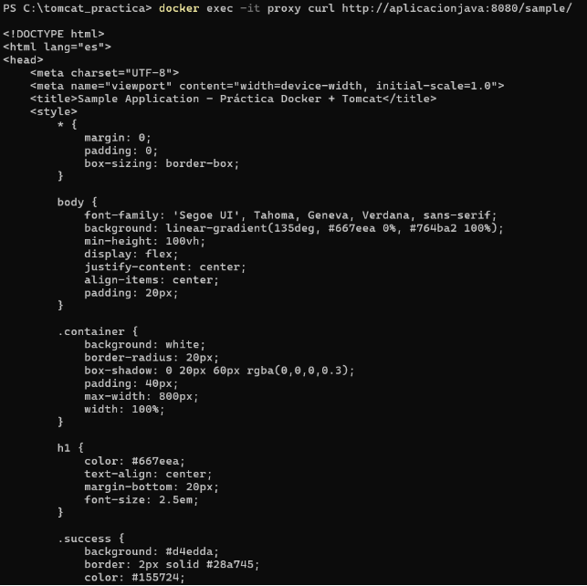

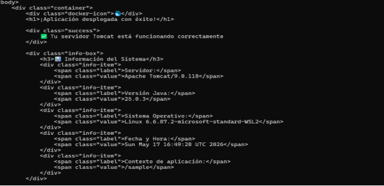

\#### Tarea 4.2: Bind mount vs volúmenes

1. Compara el uso de bind mount en esta práctica con los volúmenes usados en prácticas anteriores:
- ¿Cuándo es más apropiado usar bind mount?

cuando queremos compartir directamente una carpeta o archivo de nuestro ordenador con un contenedor. 

- ¿Cuándo es mejor usar volúmenes nombrados?

Es mejor usar volúmenes nombrados cuando queremos guardar datos importantes de forma más segura y permanente, sin depender tanto de una carpeta concreta de nuestro ordenador. 

- ¿Qué ventajas y desventajas tiene cada enfoque?

-Ventajas:

- Permite usar archivos y carpetas directamente desde nuestro ordenador.
- Es muy cómodo para desarrollo y pruebas.
- Es útil para montar archivos concretos 

-Desventajas:

- Depende de la ruta exacta del ordenador.
- Puede dar problemas si se cambia de equipo o de sistema operativo.
- Si se modifica o borra algo en el ordenador, también afecta al contenedor. 
2. Verifica en el host la ubicación de los archivos montados con bind mount.

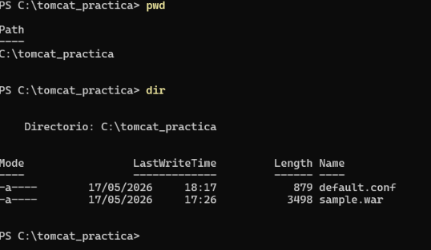

\---

\### 🔹 Parte 5: Configuración avanzada

\#### Tarea 5.1: Modificación de la configuración de Nginx

1. Investiga qué cabeceras HTTP adicionales puede configurar un proxy inverso para mejorar la funcionalidad.
- proxy\_set\_header Host $host; : Mantiene el nombre del dominio o IP que usó el cliente para acceder.
- proxy\_set\_header X-Real-IP $remote\_addr; :Envía a Tomcat la IP real del cliente que hizo la petición. Sin esta cabecera, Tomcat podría ver solo la IP del contenedor Nginx.
- proxy\_set\_header X-Forwarded-Port $server\_port; Indica el puerto por el que entró el 

  cliente. 

2. Modifica el archivo `default.conf` para añadir dentro de `location /`:
- Cabecera `Host` con el valor del host original
- Cabecera `X-Real-IP` con la IP real del cliente
- Cabecera `X-Forwarded-For` con las IPs de proxies intermedios
- Cabecera `X-Forwarded-Proto` con el protocolo usado

\*\*Pista:\*\* Investiga las directivas `proxy\_set\_header` de Nginx y las variables disponibles. server {

`    `listen 80;

`    `server\_name localhost;

- Configuración del proxy inverso hacia Tomcat

`    `location /sample/ {

`        `proxy\_pass http://aplicacionjava:8080/sample/;

- Headers para mantener información de la petición original

`        `proxy\_set\_header Host $host;

`        `proxy\_set\_header X-Real-IP $remote\_addr;

`        `proxy\_set\_header X-Forwarded-For $proxy\_add\_x\_forwarded\_for;         proxy\_set\_header X-Forwarded-Proto $scheme;

- Timeouts

`        `proxy\_connect\_timeout 60s;

`        `proxy\_send\_timeout 60s;

`        `proxy\_read\_timeout 60s;

`    `}

- Página de inicio por defecto de Nginx

`    `location / {

`        `root /usr/share/nginx/html;

`        `index index.html index.htm;

`    `}

- Gestión de páginas de error

`    `error\_page 500 502 503 504 /50x.html;

`    `location = /50x.html {

`        `root /usr/share/nginx/html;

`    `}

}

3. Investiga qué comando permite recargar la configuración de Nginx sin detener el contenedor. docker exec proxy nginx -s reload
4. Aplica los cambios y verifica que funcionan correctamente.

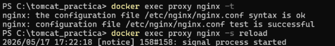

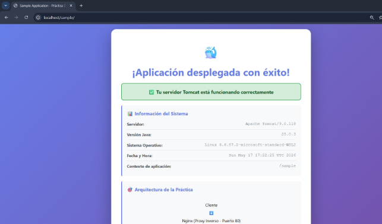

\#### Tarea 5.2: Acceso directo a Tomcat

1. Recrea el contenedor de Tomcat exponiendo el puerto 8080 al host.

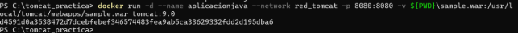

2. Accede directamente a Tomcat desde tu navegador (<http://localhost:8080/sample>).

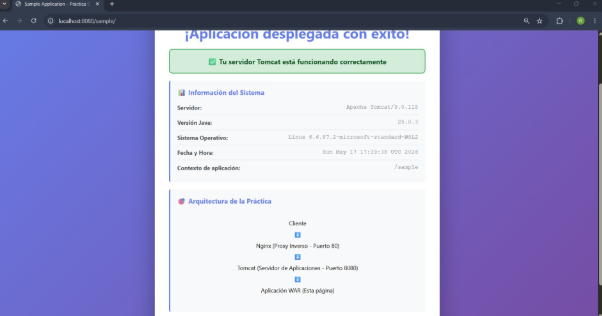

3. Compara el acceso directo con el acceso a través del proxy:
- ¿Qué diferencias observas en las URLs?

La diferencia más clara es que en el acceso directo aparece el puerto 8080, mientras que en el acceso mediante proxy no aparece porque se usa el puerto HTTP por defecto 80. 

- ¿Qué cabeceras HTTP son diferentes?

Host: Directo a Tomcat: localhost:8080 Por Nginx: localhost

X-Real-IP: Directo a Tomcat: no aparece Por Nginx: aparece X-Forwarded-For: Directo a Tomcat: no aparece Por Nginx: aparece

4. Reflexiona sobre por qué en producción no se suele exponer directamente Tomcat. #### Tarea 5.3: Múltiples aplicaciones
1. Si tienes múltiples archivos WAR, despliega más de una aplicación en Tomcat.

En producción no se suele exponer directamente Tomcat porque es más seguro y más práctico poner delante un proxy inverso como Nginx. 

2. Configura Nginx para que cada aplicación sea accesible en rutas diferentes:
- `/app1/` → aplicacion1.war
- `/app2/` → aplicacion2.war

server {

`    `listen 80;

`    `server\_name localhost;

`    `location /app1/ {

`        `proxy\_pass http://aplicacionjava:8080/app1/;

`        `proxy\_set\_header Host $host;

`        `proxy\_set\_header X-Real-IP $remote\_addr;

`        `proxy\_set\_header X-Forwarded-For $proxy\_add\_x\_forwarded\_for;         proxy\_set\_header X-Forwarded-Proto $scheme;

`        `proxy\_connect\_timeout 60s;

`        `proxy\_send\_timeout 60s;

`        `proxy\_read\_timeout 60s;

`    `}

`    `location /app2/ {

`        `proxy\_pass http://aplicacionjava:8080/app2/;

`        `proxy\_set\_header Host $host;

`        `proxy\_set\_header X-Real-IP $remote\_addr;

`        `proxy\_set\_header X-Forwarded-For $proxy\_add\_x\_forwarded\_for;         proxy\_set\_header X-Forwarded-Proto $scheme;

`        `proxy\_connect\_timeout 60s;

`        `proxy\_send\_timeout 60s;

`        `proxy\_read\_timeout 60s;

`    `}

`    `location / {

`        `root /usr/share/nginx/html;

`        `index index.html index.htm;

`    `}

`    `error\_page 500 502 503 504 /50x.html;

`    `location = /50x.html {

`        `root /usr/share/nginx/html;

`    `}

}

\---

- SEGUNDA PARTE: Automatización con Docker Compose

En esta segunda parte retomarás el mismo despliegue de \*\*Tomcat con Nginx como proxy inverso\*\*, pero utilizando \*\*Docker Compose\*\* para simplificar y automatizar la gestión. Comprenderás las ventajas de la orquestación declarativa frente a la gestión manual de contenedores.

\---

\### 🔹 Parte 7: Preparación del entorno con Docker Compose #### Tarea 7.1: Estructura de archivos

1. Crea un nuevo directorio para esta parte: `~/tomcat\_compose`.

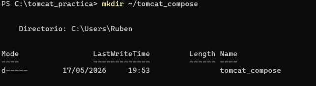

2. Dentro del directorio, crea la siguiente estructura:

\```

tomcat\_compose/

├── docker-compose.yml

├── default.conf

└── sample.war

\```

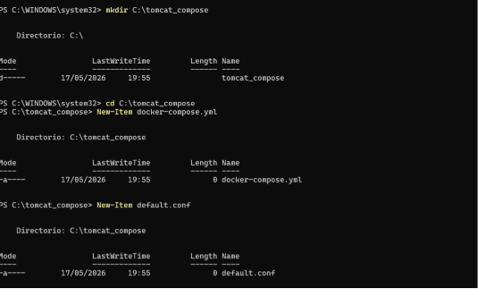

3. Copia o descarga los archivos necesarios:
- `sample.war` - La misma aplicación Java de la Primera Parte (o puedes usar otra)
- Puedes copiar el archivo WAR que ya tenías o descargar uno nuevo

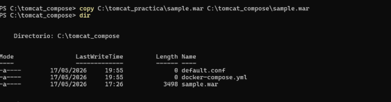

4. Crea el archivo `default.conf` con la configuración de Nginx:

\```nginx

server {

`    `listen       80;

`    `listen  [::]:80;

`    `server\_name  localhost;

`    `location / {

`        `root   /usr/share/nginx/html;

`        `proxy\_pass http://aplicacionjava:8080/sample/;     }

`    `error\_page   500 502 503 504  /50x.html;

`    `location = /50x.html {

`        `root   /usr/share/nginx/html;

`    `}

}

\```

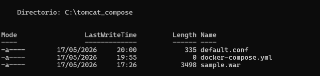

\#### Tarea 7.2: Creación del docker-compose.yml

1. Investiga la documentación de Docker Compose sobre:
- Definición de servicios

Los contenedores se definen como servicios. Cada servicio representa una parte de la aplicación. Por ejemplo, en esta práctica tendremos dos servicios: - Un servicio para Tomcat, donde se ejecutará la aplicación Java. - Un servicio para Nginx, que funcionará como proxy inverso. 

- Bind mounts en Docker Compose

Los bind mounts permiten conectar un archivo o carpeta del ordenador con una ruta dentro del contenedor. Esto sirve para que el contenedor pueda usar archivos que tenemos en nuestra máquina local. 

- Dependencias entre servicios

Docker Compose permite indicar que un servicio depende de otro usando “depends\_on”. En este caso Nginx depende de Tomcat porque Nginx tiene que enviar las peticiones hacia la aplicación Java que se ejecuta en Tomcat. Por eso en el servicio de Nginx se puede indicar que depende del servicio de Tomcat. Esto hace que Docker Compose inicie primero el contenedor de Tomcat y después el de Nginx. 

- Políticas de reinicio

En Docker Compose se escriben con la opción “restart”. Algunas políticas de reinicio son:

- “no”: el contenedor no se reinicia automáticamente. Es la opción por defecto.
- “always”: el contenedor se reinicia siempre que se detenga.
- “on-failure”: el contenedor solo se reinicia si se ha detenido por un error.
- “unless-stopped”: el contenedor se reinicia automáticamente, excepto si lo hemos parado manualmente. 
2. Crea un archivo `docker-compose.yml` que defina:

`    `\*\*Servicio de Tomcat (`aplicacionjava`):\*\*

- Imagen: `tomcat:9.0`
- Bind mount del archivo WAR al directorio de despliegue de Tomcat 

(`/usr/local/tomcat/webapps/`)

- Montaje en modo solo lectura (`:ro`)
- NO mapear puertos al host (acceso solo interno)
- Política de reinicio: `always`

`    `\*\*Servicio de Nginx (`proxy`):\*\*

- Imagen: `nginx`
- Puerto 80 del host mapeado al puerto 80 del contenedor
- Bind mount del archivo de configuración a `/etc/nginx/conf.d/default.conf`
- Montaje en modo solo lectura (`:ro`)
  - Dependencia del servicio de Tomcat (`depends\_on`)
- Política de reinicio: `always`

services:

`  `aplicacionjava:

`    `image: tomcat:9.0

`    `volumes:

- ./sample.war:/usr/local/tomcat/webapps/sample.war:ro

`    `restart: always

`  `proxy:

`    `image: nginx

`    `ports:

- "80:80"

`    `volumes:

- ./default.conf:/etc/nginx/conf.d/default.conf:ro

`    `depends\_on:

- aplicacionjava

restart: always

3. Analiza y responde:
- ¿Por qué se usan bind mounts en lugar de volúmenes Docker en este caso?

Se usan bind mounts porque necesitamos montar archivos concretos que ya tenemos en nuestro ordenador, como el archivo sample.war y el archivo default.conf.

- ¿Qué significa `:ro` y por qué es importante usarlo?

:ro significa read only, es decir, solo lectura. Esto quiere decir que el contenedor puede leer el archivo, pero no puede modificarlo.

- ¿Por qué Nginx depende de Tomcat (`depends\_on`)?

Nginx depende de Tomcat porque Nginx funciona como proxy inverso y envía las peticiones hacia la aplicación Java que está dentro de Tomcat. 

- ¿Por qué Tomcat no expone puertos al host?

Porque la idea es que el único punto de entrada sea Nginx usando el puerto 80. Esto es más seguro . 

- ¿Cómo se comunican los contenedores entre sí?

Los contenedores se comunican entre sí usando la red interna que Docker Compose crea automáticamente. 

\---

\### 🔹 Parte 8: Despliegue y verificación con Compose #### Tarea 8.1: Despliegue del escenario

1. Desde el directorio del proyecto (`~/tomcat\_compose`), despliega todos los servicios con Docker Compose.
1. Observa la salida del comando y verifica:
- Qué red se crea automáticamente
- En qué orden se inician los servicios
- Si hay algún error durante el despliegue

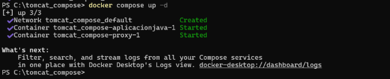

3. Comprueba que ambos servicios están en ejecución y su estado.

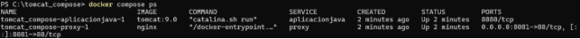

4. Accede a la aplicación desde tu navegador ([http://localhost](http://localhost/)).
4. Verifica que estás accediendo a través del proxy (puerto 80, no 8080).

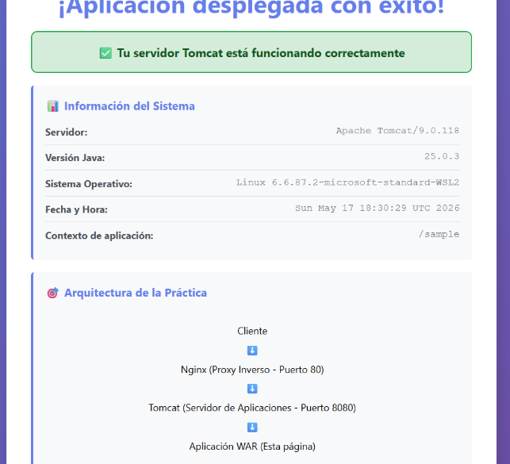

6. Compara con la Primera Parte:
- ¿Cuántos comandos necesitaste en la Primera Parte?
- ¿Cuántos comandos has usado ahora?
- ¿Qué es más fácil de documentar y versionar?

\#### Tarea 8.2: Verificación de bind mounts

1. Verifica que los archivos se han montado correctamente:
- Accede al contenedor de Tomcat y verifica que `sample.war` está en 

`/usr/local/tomcat/webapps/`

- Accede al contenedor de Nginx y verifica que `default.conf` está en `/etc/nginx/conf.d/`

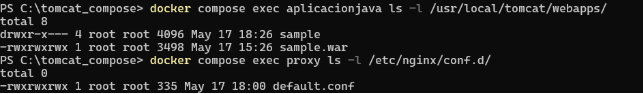

2. Modifica el archivo `default.conf` en el host (añade un comentario o cambia algo menor). server {

   #Escucha peticiones en el puerto 80

   `    `listen       80;

   `    `listen  [::]:80;

   `    `server\_name  localhost;

   `    `location / {

   `        `root   /usr/share/nginx/html;

   `        `proxy\_pass http://aplicacionjava:8080/sample/;     }

   `    `error\_page   500 502 503 504  /50x.html;

   `    `location = /50x.html {

   `        `root   /usr/share/nginx/html;

   `    `}

   }

3. Investiga cómo recargar la configuración de Nginx sin reiniciar el contenedor usando Docker Compose.

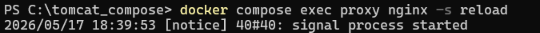

4. Recarga la configuración y verifica que el cambio se ha aplicado.

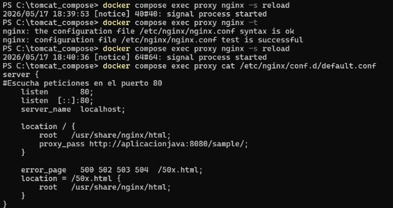

5. Compara con la Primera Parte:
- ¿Es más fácil hacer cambios en configuración con Compose?

Si es más fácil hacer cambios en la configuración con Docker Compose, porque los servicios, los puertos, los volúmenes y las redes están definidos en un único archivo docker- compose.yml 

- ¿Qué ventajas tiene tener todos los archivos juntos en un directorio?
  - Es más fácil encontrar y modificar los archivos necesarios.
  - El proyecto queda más ordenado.
  - Se puede copiar o mover el entorno completo fácilmente.
  - Es más sencillo documentarlo. 

\#### Tarea 8.3: Análisis de logs

1. Visualiza los logs de ambos servicios con Docker Compose.

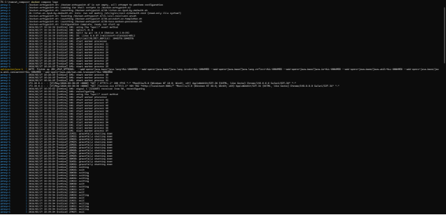

2. Visualiza los logs solo del servicio de Nginx.

   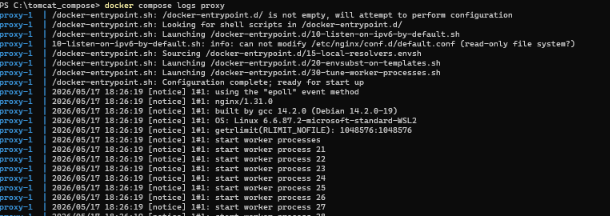

3. Visualiza los logs solo del servicio de Tomcat.

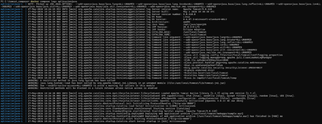

4. Identifica en los logs:
- En Nginx: las peticiones que redirige a Tomcat
- En Tomcat: el despliegue de la aplicación WAR
5. Realiza varias peticiones HTTP desde el navegador y observa cómo se registran en ambos servicios.

   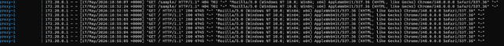

6. Compara con la Primera Parte:
- ¿Es más fácil ver los logs con Compose?

Si, es más fácil ver los logs con Docker Compose. En la primera parte, si los contenedores se 

creaban manualmente con docker run, había que saber el nombre o el ID de cada contenedor y ejecutar comandos por separado

- ¿Qué ventajas tiene poder ver logs de múltiples servicios a la vez?
- Permite comprobar el recorrido completo de una petición.
- Se puede ver cuándo Nginx recibe una petición y cuándo Tomcat responde.
- Ayuda a detectar errores de comunicación entre servicios.
- Facilita encontrar problemas de configuración, por ejemplo rutas incorrectas o errores

\---

\### 🔹 Parte 9: Configuración avanzada con Compose

\#### Tarea 9.1: Mejora de la configuración de Nginx

1. Modifica el archivo `default.conf` para añadir cabeceras de proxy que mejoren la funcionalidad:

\```nginx

server {

`    `listen       80;

`    `listen  [::]:80;

`    `server\_name  localhost;

`    `location / {

`        `proxy\_pass http://aplicacionjava:8080/sample/;

`        `proxy\_set\_header Host $host;

`        `proxy\_set\_header X-Real-IP $remote\_addr;

`        `proxy\_set\_header X-Forwarded-For $proxy\_add\_x\_forwarded\_for;         proxy\_set\_header X-Forwarded-Proto $scheme;

- Timeouts

`        `proxy\_connect\_timeout 60s;

`        `proxy\_send\_timeout 60s;

`        `proxy\_read\_timeout 60s;

`    `}

`    `error\_page   500 502 503 504  /50x.html;

`    `location = /50x.html {

`        `root   /usr/share/nginx/html;

`    `}

}

\```

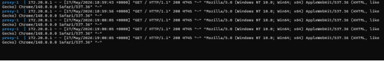

2. Explica qué hace cada directiva añadida:
- `proxy\_set\_header Host`

Envía al servidor Tomcat el valor del encabezado Host original de la petición. 

- `proxy\_set\_header X-Real-IP`

Envía a Tomcat la IP real del cliente que hizo la petición. Sin esta cabecera Tomcat podría ver únicamente la IP del contenedor Nginx ya que Nginx actúa como intermediario.

- `proxy\_set\_header X-Forwarded-For`

Añade la IP del cliente a la cabecera X-Forwarded-For. Sirve para mantener un historial de las IPs por las que ha pasado la petición antes de llegar a Tomcat.

- `proxy\_set\_header X-Forwarded-Proto`

Informa a Tomcat del protocolo original utilizado por el cliente.

- Las directivas de timeout

Las directivas de timeout controlan cuánto tiempo espera Nginx en diferentes fases de la comunicación con Tomcat. 

3. Recarga Nginx sin detener el contenedor.

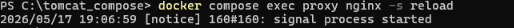

4. Verifica que las cabeceras se están enviando correctamente.

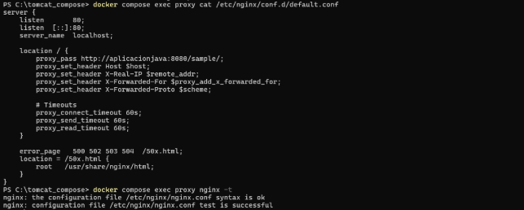

\#### Tarea 9.2: Variables de entorno y customización

1. Crea un archivo `.env` en el mismo directorio con variables para:
   - Puerto de Nginx (por ejemplo: `NGINX\_PORT=80`)
   - Versión de Tomcat a usar (por ejemplo: `TOMCAT\_VERSION=9.0`)
- Nombre del archivo WAR (por ejemplo: `WAR\_FILE=sample.war`)

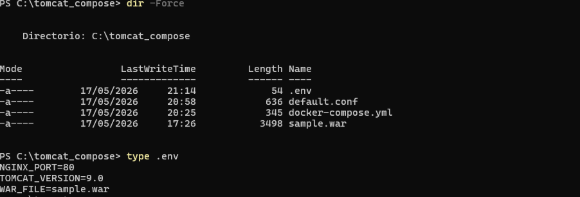

2. Modifica tu `docker-compose.yml` para usar estas variables con la sintaxis `${VARIABLE}`.

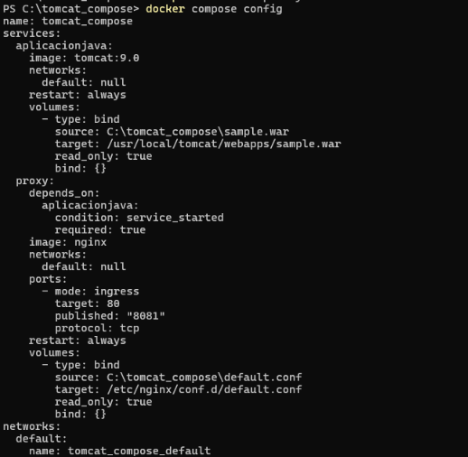

3. Cambia el puerto de Nginx a 8080 en el archivo `.env`.

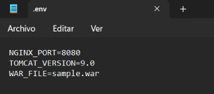

4. Reinicia los servicios y verifica que la aplicación ahora es accesible en http://localhost:8080.

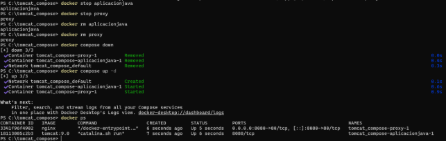

5. Vuelve a cambiar el puerto a 80.

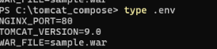

6. Prueba cambiando la versión de Tomcat (por ejemplo, a `10.1`) y verifica que se usa la nueva versión.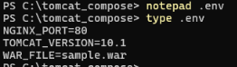
6. Reflexiona:
- ¿Qué ventajas tiene usar variables de entorno?
- Evitan modificar directamente el docker-compose.yml: el archivo principal de Docker Compose queda más limpio y reutilizable.
- Facilitan los cambios: si se quiere cambiar el puerto de 8080 a 80, o cambiar Tomcat de 9.0 a 10.1, solo hay que modificar una línea en el archivo .env.
- Mejoran la reutilización: el mismo docker-compose.yml puede usarse en diferentes máquinas o escenarios cambiando únicamente las variables.
- Reducen errores: al tener los valores configurables separados del archivo principal, es más fácil identificar qué parámetros se están usando.
- ¿Es más fácil adaptar la configuración a diferentes entornos (dev, test, prod)?

Sí, es más fácil.  Ya que podemos usar la misma estructura de proyecto para distintos entornos por ejemplo:

#Ent 1

NGINX\_PORT=8080

TOMCAT\_VERSION=9.0

WAR\_FILE=sample-dev.war

#Ent 2

NGINX\_PORT=8081

TOMCAT\_VERSION=10.1

` `WAR\_FILE=sample-test.war 

\---

\### 🔹 Parte 10: Análisis comparativo

\#### Tarea 10.1: Comparación entre gestión manual y Docker Compose

Completa la siguiente tabla comparativa analizando ambas partes de la práctica:


|Aspecto|Gestión manual (Parte 1)|Docker Compose (Parte 2)|
| - | - | - |
|Nº de comandos para desplegar|Se necesitan varios comandos: crear red, crear contenedor Tomcat, montar el WAR, crear contenedor Nginx, mapear puertos, etc. Es más fácil olvidarse de algún paso. |Se reduce casi todo a un comando principal: docker compose up -d. La configuración ya está definida en el archivo docker- compose.yml. |
|Creación de red  |Hay que crear la red manualmente con docker network create y después conectar los contenedores a esa red. |Docker Compose crea automáticamente una red para los servicios definidos, por lo que Tomcat y Nginx pueden comunicarse entre sí sin configurarlo todo a mano. |
|Montaje de archivos      |Los volúmenes se indican manualmente en cada docker run, por ejemplo para montar el .war o la configuración de Nginx. |Los montajes quedan escritos en el docker-compose.yml, así que son más fáciles de revisar, repetir y modificar. |
|Despliegue de app WAR|Hay que indicar manualmente el montaje del archivo WAR en la ruta correcta de Tomcat. Si se escribe mal la ruta, la aplicación no se despliega |<p>El WAR queda definido como volumen en Compose. Además, usando variables </p><p>como WAR\_FILE, se puede cambiar el archivo desplegado sin tocar todo el comando. </p>|
|Configuración de Nginx |Se monta manualmente el archivo default.conf al crear el contenedor. Si se reinicia desde cero, hay que recordar el comando completo. |<p>La configuración de Nginx queda declarada en el </p><p>servicio proxy. Es más claro ver qué archivo se está usando y dónde se monta. </p>|
|Actualización de app    |Para actualizar el WAR normalmente hay que parar, eliminar y volver a crear el contenedor o asegurarse de volver a montar el archivo correctamente. |<p>Basta con cambiar el archivo WAR o modificar la </p><p>variable WAR\_FILE, y después ejecutar docker compose </p><p>down y docker compose up -d. </p>|
|Modificación de configuración |Cualquier cambio requiere repetir comandos largos o recordar qué parámetros se usaron al crear cada contenedor. |Los cambios se hacen editando archivos: .env, docker- compose.yml o default.conf. Es más ordenado y menos propenso a errores. |
|Reproducibilidad en otro equipo|Es menos reproducible, porque otra persona tendría que seguir |Es mucho más reproducible. Basta con compartir la carpeta |


||exactamente los mismos comandos y no equivocarse en nombres, puertos, redes o volúmenes. |del proyecto y ejecutar docker compose up -d, siempre que Docker esté instalado. |
| :- | :- | :- |
|Facilidad de versionado (git)|Los comandos manuales no quedan guardados salvo que se documenten aparte en un README. Es fácil que la configuración real no coincida con la documentación. |Se pueden versionar docker- compose.yml, .env.example, def ault.conf y el README. La arquitectura queda reflejada en archivos. |
|Documentación de la arquitectura|<p>La arquitectura depende de lo que se haya ejecutado en la terminal. Para entenderla hay que revisar comandos anteriores</p><p>o documentarlos manualmente. </p>|<p>El propio docker- compose.yml actúa como documentación: muestra </p><p>` `servicios, imágenes, puertos, volúmenes y dependencias. </p>|
|Gestión de dependencias   |Hay que arrancar los contenedores en el orden correcto y asegurarse de que Nginx pueda encontrar a Tomcat. |<p>Compose permite declarar dependencias con depends\_on, por ejemplo que </p><p>el proxy dependa </p><p>de aplicacionjava. </p>|
|Escalabilidad (múltiples réplicas)|Es más complicada. Habría que crear varios contenedores manualmente, con nombres distintos, puertos distintos y configuración adicional. |Es más sencilla, porque Compose permite escalar servicios con opciones como -- scale, aunque habría que adaptar Nginx si se quieren balancear varias réplicas. |

\#### Tarea 10.2: Preguntas de análisis final

Responde a las siguientes preguntas en tu documentación: \*\*1. Comparación entre enfoques:\*\*

- ¿Cuántos comandos necesitabas en la Primera Parte vs la Segunda Parte?

En la Primera Parte, usando gestión manual, se necesitaban bastantes comandos. Había que crear la red, arrancar el contenedor de Tomcat, montar el archivo WAR, arrancar el contenedor de Nginx, montar su configuración, mapear puertos y comprobar que todo funcionaba. Por ejemplo:

docker network create red\_app

docker run ...

docker run ...

docker ps

docker logs …

En la Segunda Parte se simplifica todo una vez creados los archivos docker-compose.yml, .env y default.conf se basa en ejecutar:

docker compose up -d

docker compose down

Por tanto, en la primera parte se necesitaban muchos más comandos mientras que en la segunda parte el despliegue se reduce a dos comandos principales.

- ¿Qué enfoque es más fácil de compartir con tu equipo?

El enfoque más fácil de compartir con el equipo es Docker Compose. Con la gestión manual, habría que pasar a los compañeros una lista de comandos y confiar en que los ejecuten exactamente igual, sin equivocarse en nombres de contenedores, puertos, rutas o redes.

- ¿Cuál es más fácil de versionar con Git?

Es más fácil de versionar con Git el enfoque de Docker Compose. Porque la configuración queda  guardada en archivos de texto

- Si tuvieras que desplegar esta arquitectura en 10 servidores diferentes, ¿qué enfoque usarías? Usaría Docker Compose Si tuviera que desplegar la arquitectura en 10 servidores diferentes, no sería práctico repetir todos los comandos manuales en cada servidor. Sería fácil cometer errores, por ejemplo usando un puerto incorrecto, olvidando crear la red o montando mal el archivo WAR.

\*\*2. Montajes de solo lectura (`:ro`):\*\*

- ¿Por qué es buena práctica montar archivos como solo lectura?

Porque evita que el contenedor pueda modificar archivos importantes del equipo 

- ¿Qué riesgos evitas al usar `:ro`?
- Modificaciones accidentales: si un proceso dentro del contenedor falla o está mal configurado, no podrá sobrescribir el archivo original.
- Borrado de archivos importantes: el contenedor no podrá eliminar archivos montados desde el host.
- Problemas de seguridad: si alguien consigue acceso al contenedor, tendrá menos capacidad para alterar archivos del sistema anfitrión.
- ¿En qué casos NO usarías `:ro`? (pista: piensa en archivos de logs o datos) Cuando el contenedor necesita escribir datos en el volumen 

\*\*3. Arquitectura de proxy inverso:\*\*

- ¿Qué ventajas aporta Docker Compose a esta arquitectura específica?
- Permite definir toda la arquitectura en un único archivo
- En lugar de crear cada contenedor manualmente con comandos largos, Compose permite levantar todo con  un solo comando
- Docker Compose crea automáticamente una red interna para los servicios. 
- ¿Es más fácil modificar la configuración del proxy con Compose?

Sí, es más fácil con Docker Compose, el archivo de configuración de Nginx se monta como volumen:

volumes:

- ./default.conf:/etc/nginx/conf.d/default.conf:ro

  Esto permite editar el archivo default.conf directamente desde la carpeta del proyecto, sin entrar dentro del contenedor.

- ¿Cómo facilita Docker Compose el despliegue de nuevas aplicaciones?

Docker Compose facilita el despliegue de nuevas aplicaciones porque permite cambiar o añadir servicios de forma ordenada. 

- ¿Cómo añadirías un segundo servidor Tomcat para balanceo de carga?

Para añadir un segundo servidor Tomcat, se puede declarar otro servicio en docker-compose.yml, por ejemplo aplicacionjava2 por ejemplo:

services:

`  `aplicacionjava1:

`    `image: tomcat:${TOMCAT\_VERSION}

`    `volumes:

- ./${WAR\_FILE}:/usr/local/tomcat/webapps/${WAR\_FILE}:ro

`    `restart: always

`  `aplicacionjava2:

`    `image: tomcat:${TOMCAT\_VERSION}

`    `volumes:

- ./${WAR\_FILE}:/usr/local/tomcat/webapps/${WAR\_FILE}:ro

`    `restart: always

`  `proxy:

`    `image: nginx

`    `ports:

- "${NGINX\_PORT}:80"

`    `volumes:

- ./default.conf:/etc/nginx/conf.d/default.conf:ro

`    `depends\_on:

- aplicacionjava1
- aplicacionjava2

`    `restart: always

\*\*4. Dependencias entre servicios:\*\*

- ¿Por qué Nginx depende de Tomcat (`depends\_on`)?

Nginx actúa como proxy inverso y necesita enviar las peticiones hacia el servidor de aplicaciones.

Es decir:

- el usuario entra por Nginx;
- Nginx recibe la petición HTTP;
- Nginx la reenvía a Tomcat;
- Tomcat ejecuta la aplicación Java;
- Tomcat devuelve la respuesta a Nginx;
- Nginx responde al usuario.
- ¿Qué pasa si Tomcat no está listo cuando Nginx arranca?

Si Nginx arranca antes de que Tomcat esté preparado, Nginx puede recibir peticiones pero no conseguir conectarse correctamente al backend. 

- ¿Es suficiente `depends\_on` para garantizar que Tomcat está listo? ¿Por qué?

depends\_on no es suficiente para garantizar que Tomcat está listo.                                       

depends\_on solo asegura el orden de arranque de los contenedores. Es decir, Docker Compose inicia primero Tomcat y después Nginx.

\*\*5. Entornos de desarrollo vs producción:\*\*

- ¿Cómo usarías el archivo `.env` para diferentes entornos?

Usaría el archivo .env para separar la configuración de cada entorno sin modificar directamente el 

archivo docker-compose.yml. La idea sería mantener el mismo docker-compose.yml, pero cambiar los valores del archivo .env según el entorno donde se vaya a desplegar.

- ¿Qué configuraciones cambiarían entre desarrollo y producción?

En desarrollo, normalmente interesa trabajar de forma más flexible, poder probar cambios rápido y ver más información cuando algo falla. En cambio, en producción, lo más importante es la estabilidad, la seguridad y que la aplicación funcione correctamente para los usuarios finales. 

- ¿Cómo gestionarías secretos (contraseñas, API keys) con Docker Compose?

Los secretos no deberían escribirse directamente en el docker-compose.yml, porque ese  archivo 

normalmente se sube a Git.Tampoco es buena práctica subir un .env real con contraseñas al repositorio

\---

\## Entregables

\### Entregables de la Primera Parte (Gestión Manual)

1. \*\*Documentación en formato Markdown o PDF\*\* que incluya:
- Todos los comandos utilizados en cada tarea de las Partes 1-5
- Archivo de configuración `default.conf` completo y explicado
- Capturas de pantalla que demuestren:
  - La aplicación funcionando a través del proxy
  - Lista de contenedores en ejecución
  - Inspección de la red Docker
  - Logs de Tomcat mostrando el despliegue de la aplicación
  - Logs de Nginx
  - Acceso directo a Tomcat (si realizas la tarea 5.2)
  - Estructura de directorios con bind mounts
- Diagrama del flujo de peticiones (cliente → Nginx → Tomcat)
2. \*\*Archivos de configuración:\*\*
- `default.conf` - Configuración básica de Nginx
- `default.conf` (versión avanzada) - Con cabeceras adicionales

\### Entregables de la Segunda Parte (Docker Compose)

1\. \*\*Documentación en formato Markdown o PDF\*\* que incluya:

1. Archivo `docker-compose.yml` completo y comentado
1. Archivo `default.conf` para Docker Compose (con cabeceras de proxy)
1. Archivo `.env` con variables de entorno
1. Todos los comandos Docker Compose utilizados en las Partes 7-9
1. Capturas de pantalla que demuestren:
   1. Aplicación funcionando a través del proxy con Compose
   1. Estructura de archivos del proyecto (`docker-compose.yml`, `default.conf`, `sample.war`)
   1. Servicios en ejecución (`docker compose ps`)
   1. Logs de ambos servicios
   1. Prueba de variables de entorno funcionando
1. Respuestas a todas las preguntas de análisis
2. \*\*Archivos del proyecto Docker Compose:\*\*
   1. `docker-compose.yml`
   1. `default.conf`
   1. `.env` (archivo de variables de entorno)

\### Entregables de Análisis Comparativo (Parte 10) 1. \*\*Análisis comparativo:\*\*

- Tabla comparativa completada (Tarea 10.1)
- Respuestas detalladas a todas las preguntas de análisis final (Tarea 10.2)
- Reflexión personal sobre qué enfoque prefieres y por qué
- Casos de uso donde usarías cada enfoque

\---

\### Evaluación

Se evaluará:

\*\*De la Primera Parte:\*\*

- La correcta configuración del proxy inverso con comandos Docker.
- El funcionamiento completo de la aplicación a través de Nginx.
- La comprensión del flujo de peticiones.
- El uso apropiado de bind mounts y redes Docker.
- La correcta gestión de contenedores mediante CLI.

\*\*De la Segunda Parte:\*\*

- La correcta configuración del proxy inverso con Docker Compose.
- El uso apropiado de bind mounts en el archivo `docker-compose.yml`.
- El uso de variables de entorno.
- La comprensión de las dependencias entre servicios.

\*\*Del Análisis Comparativo:\*\*

- La profundidad del análisis comparativo entre ambos enfoques.
- La comprensión de ventajas y desventajas de cada método.
- La calidad de las respuestas a las preguntas de análisis.
- La claridad y completitud de la documentación.

\*\*Criterios transversales:\*\*

- Claridad y organización de la documentación.
- Calidad y relevancia de las capturas de pantalla.
- Profundidad del análisis técnico.
- Capacidad de reflexión crítica.
- Aplicación de conceptos aprendidos en prácticas anteriores.

\---

\### Condiciones de entrega

Las publicadas en la plataforma Moodle del curso. ---

\### Estimación de tiempo

\*\*Tiempo estimado total: 5-6 horas\*\*

Desglose aproximado:

- \*\*Primera Parte (Gestión Manual):\*\* 3-3.5 horas
  - Parte 1 (Preparación): 30 min
  - Parte 2 (Tomcat): 30 min
  - Parte 3 (Nginx): 45 min
  - Parte 4 (Análisis arquitectura): 30 min
  - Parte 5 (Configuración avanzada): 1-1.5 horas
- \*\*Segunda Parte (Docker Compose):\*\* 1.5-2 horas
  - Parte 7 (Preparación Compose): 20 min
  - Parte 8 (Despliegue y verificación): 30 min
  - Parte 9 (Configuración avanzada): 40-50 min
- \*\*Análisis Comparativo (Parte 10):\*\* 30-40 min
  - Tabla comparativa: 10-15 min
  - Preguntas de análisis: 20-25 min

\---

\### Recursos de apoyo

\*\*Recursos generales:\*\*

- Documentación oficial de Docker: [https://docs.docker.com](https://docs.docker.com)
- Documentación oficial de Docker Compose: [https://docs.docker.com/compose/](https://docs.docker.com/compose/)
- Repositorio con ejemplos: [https://github.com/josedom24/curso\_docker\_ies](https://github.com/ josedom24/curso\_docker\_ies)

  \*\*Tomcat:\*\*

- Imagen Tomcat en Docker Hub: [https://hub.docker.com/\_/tomcat](https://hub.docker.com/\_/tomcat)
- Documentación de Tomcat: [https://tomcat.apache.org/tomcat-9.0-doc/](https://tomcat.apache.org/tomcat-9.0-doc/)
- Despliegue de aplicaciones WAR: [https://tomcat.apache.org/tomcat-9.0-doc/deployer- howto.html](https://tomcat.apache.org/tomcat-9.0-doc/deployer-howto.html)

  \*\*Nginx:\*\*

- Imagen Nginx en Docker Hub: [https://hub.docker.com/\_/nginx](https://hub.docker.com/\_/nginx)
- Documentación de Nginx: [https://nginx.org/en/docs/](https://nginx.org/en/docs/)
- Nginx como proxy inverso: [https://docs.nginx.com/nginx/admin-guide/web-server/reverse- proxy/](https://docs.nginx.com/nginx/admin-guide/web-server/reverse-proxy/)
- Configuración de cabeceras proxy: [http://nginx.org/en/docs/http/ngx\_http\_proxy\_module.html] (http://nginx.org/en/docs/http/ngx\_http\_proxy\_module.html)

  \*\*Docker Compose:\*\*

- Compose file reference: [https://docs.docker.com/compose/compose-file/](https://docs.docker.com/compose/compose-file/)
- Bind mounts en Compose: [https://docs.docker.com/compose/compose-file/07-volumes/](https:// docs.docker.com/compose/compose-file/07-volumes/)
- Networks en Compose: [https://docs.docker.com/compose/networking/](https://docs.docker.com/ compose/networking/)

  \*\*Conceptos adicionales:\*\*

- Bind mounts en Docker: [https://docs.docker.com/storage/bind-mounts/](https://docs.docker.com/ storage/bind-mounts/)
- Docker networking: [https://docs.docker.com/network/](https://docs.docker.com/network/)
- Archivos WAR (Web Application Archive): [https://en.wikipedia.org/wiki/WAR\_(file\_format)] (https://en.wikipedia.org/wiki/WAR\_(file\_format))

  ---
