- Práctica 2.3

\### Descripción

\*\*Actividad:\*\* \*Construcción de imagen Docker con PHP y base de datos\*

En esta práctica crearás una imagen Docker personalizada para una aplicación PHP que se conecta a una base de datos MariaDB. Aprenderás a construir imágenes configurables mediante variables de entorno y a inicializar bases de datos automáticamente.

\#### Objetivo general

Aprender a:

- Construir imágenes configurables con variables de entorno.
- Conectar aplicaciones PHP con bases de datos.
- Instalar extensiones PHP para acceso a bases de datos.
- Crear scripts de inicialización para contenedores.
- Gestionar dependencias entre contenedores.
- Inicializar bases de datos automáticamente.

\---

\### Contexto de trabajo

Las aplicaciones web modernas normalmente necesitan acceder a bases de datos. En Docker, esto implica:

- \*\*Imagen de aplicación:\*\* Contiene el código PHP y las extensiones necesarias
- \*\*Imagen de base de datos:\*\* Contenedor separado con MariaDB/MySQL
- \*\*Variables de entorno:\*\* Para configurar la conexión de forma flexible
- \*\*Script de inicialización:\*\* Para preparar la base de datos al iniciar

\*\*Arquitectura de la aplicación:\*\*

\```

┌─────────────────────┐          ┌──────────────────────┐ │   Contenedor PHP    │─────────▶│  Contenedor MariaDB  │

│  (Tu imagen)        │          │  (Imagen oficial)    │

│                     │          │                      │

│  - Apache + PHP     │          │  - Base de datos     │

│  - App PHP          │          │  - Puerto 3306       │

│  - Script init      │          │  - Volumen datos     │

│  - Puerto 80        │          │                      │

└─────────────────────┘          └──────────────────────┘ ```

\---

\### 📦 Archivos de la aplicación

Se te proporcionan todos los archivos necesarios. Créalos en un directorio `build/`:

\#### Archivo `build/app/index.php`:

\```php

<!DOCTYPE html>

<html lang="es">

<head>

`    `<meta charset="UTF-8">

`    `<meta name="viewport" content="width=device-width, initial-scale=1.0">     <title>Gestión de Usuarios - Docker</title>

`    `<style>

\* {

`            `margin: 0;

`            `padding: 0;

`            `box-sizing: border-box;

`        `}

`        `body {

`            `font-family: 'Segoe UI', Tahoma, Geneva, Verdana, sans-serif;

`            `background: linear-gradient(135deg, #667eea 0%, #764ba2 100%);

`            `min-height: 100vh;

`            `padding: 20px;

`        `}

.container {

`            `max-width: 900px;

`            `margin: 0 auto;

`            `background: white;

`            `border-radius: 15px;

`            `box-shadow: 0 20px 60px rgba(0,0,0,0.3);

`            `overflow: hidden;

`        `}

.header {

`            `background: linear-gradient(135deg, #667eea 0%, #764ba2 100%);

`            `color: white;

`            `padding: 30px;

`            `text-align: center;

`        `}

.header h1 {

`            `font-size: 2.5em;

`            `margin-bottom: 10px;

`        `}

.content {

`            `padding: 30px;

`        `}

.info-box {

`            `background: #f8f9fa;

`            `border-left: 4px solid #667eea;

`            `padding: 15px;

`            `margin: 20px 0;

`            `border-radius: 5px;

`        `}

.success {

`            `background: #d4edda;

`            `border-left-color: #28a745;

`            `color: #155724;

`        `}

.error {

`            `background: #f8d7da;

`            `border-left-color: #dc3545;

`            `color: #721c24;

`        `}

`        `table {

`            `width: 100%;

`            `border-collapse: collapse;

`            `margin: 20px 0;

`            `box-shadow: 0 2px 10px rgba(0,0,0,0.1);

`        `}

`        `thead {

`            `background: #667eea;

`            `color: white;

`        `}

`        `th, td {

`            `padding: 15px;

`            `text-align: left;

`            `border-bottom: 1px solid #ddd;

`        `}

`        `tbody tr:hover {

`            `background: #f5f5f5;

`        `}

`        `tbody tr:nth-child(even) {

`            `background: #f9f9f9;

`        `}

.db-info {

`            `display: grid;

`            `grid-template-columns: repeat(auto-fit, minmax(200px, 1fr));             gap: 15px;

`            `margin: 20px 0;

`        `}

.db-card {

`            `background: #e3f2fd;

`            `padding: 15px;

`            `border-radius: 8px;

`            `border-left: 3px solid #2196F3;

`        `}

.db-card strong {

`            `display: block;

`            `color: #1976D2;

`            `margin-bottom: 5px;

`            `font-size: 0.9em;

`        `}

.db-card span {

`            `font-size: 1.1em;

`            `font-weight: 600;

`            `color: #333;

`        `}

`    `</style>

</head>

<body>

`    `<div class="container">

`        `<div class="header">

`            `< h1>🗄️ Gestión de Usuarios</h1>

`            `<p>Aplicación PHP + MariaDB en Docker</p>         </div>

`        `<div class="content">

`            `<h2>Información de Conexión</h2>

`            `<div class="db-info">

`                `<div class="db-card">

`                    `<strong>Host de Base de Datos:</strong>

`                    `<span><?php echo getenv('DB\_HOST') ?: 'No configurado'; ?></span>                 </div>

`                `<div class="db-card">

`                    `<strong>Base de Datos:</strong>

`                    `<span><?php echo getenv('DB\_NAME') ?: 'No configurado'; ?></span>                 </div>

`                `<div class="db-card">

`                    `<strong>Usuario:</strong>

`                    `<span><?php echo getenv('DB\_USER') ?: 'No configurado'; ?></span>                 </div>

`            `</div>

`            `<?php

`            `// Leer credenciales desde variables de entorno             $host = getenv('DB\_HOST');

`            `$user = getenv('DB\_USER');

`            `$pass = getenv('DB\_PASS');

`            `$db = getenv('DB\_NAME');

`            `// Intentar conectar a la base de datos

`            `$conn = new mysqli($host, $user, $pass, $db);

`            `if ($conn->connect\_error) {

`                `echo '<div class="info-box error">';

`                `echo '<h3>❌ Error de Conexión</h3>';

`                `echo '<p><strong>Error:</strong> ' . htmlspecialchars($conn->connect\_error) . '</p>';                 echo '<p><strong>Código:</strong> ' . $conn->connect\_errno . '</p>';

`                `echo '</div>';

`            `} else {

`                `echo '<div class="info-box success">';

`                `echo '<h3>✅ Conexión Exitosa</h3>';

`                `echo '<p>Conectado correctamente a la base de datos MariaDB</p>';

`                `echo '</div>';

`                `// Consultar usuarios

`                `$sql = 'SELECT \* FROM users';

`                `$users = [];

`                `if ($result = $conn->query($sql)) {

`                    `while ($data = $result->fetch\_object()) {                         $users[] = $data;

`                    `}

`                    `$result->free();

`                `}

`                `if (count($users) > 0) {

`                    `echo '<h2>Lista de Usuarios</h2>';

`                    `echo '<table>';

`                    `echo '<thead><tr><th>ID</th><th>Usuario</th><th>Email</th><th>Fecha Registro</th></tr></thead>';

`                    `echo '<tbody>';

`                    `foreach ($users as $user) {

`                        `echo '<tr>';

`                        `echo '<td>' . htmlspecialchars($user->id) . '</td>';

`                        `echo '<td>' . htmlspecialchars($user->username) . '</td>';

`                        `echo '<td>' . htmlspecialchars($user->email) . '</td>';

`                        `echo '<td>' . htmlspecialchars($user->created\_at ?? 'N/A') . '</td>';

`                        `echo '</tr>';

`                    `}

`                    `echo '</tbody>';

`                    `echo '</table>';

`                    `echo '<div class="info-box">';

`                    `echo '<p><strong>Total de usuarios:</strong> ' . count($users) . '</p>';

`                    `echo '</div>';

`                `} else {

`                    `echo '<div class="info-box">';

`                    `echo '<p> No hay usuarios registrados en la base de datos.</p>';

`                    `echo '</div>';

`                `}

`                `mysqli\_close($conn);

`            `}

`            `?>

`            `<div class="info-box" style="margin-top: 30px; background: #fff3cd; border-left-color: #ffc107;">

`                `<h3> Información Técnica</h3>

`                `<p><strong>PHP Version:</strong> <?php echo phpversion(); ?></p>

`                `<p><strong>Extensión MySQLi:</strong> <?php echo extension\_loaded('mysqli') ? '✓ Cargada' : '✗ No cargada'; ?></p>

`                `<p><strong>Servidor:</strong> <?php echo $\_SERVER['SERVER\_SOFTWARE']; ? ></p>

`            `</div>

`        `</div>

`    `</div>

</body>

</html>

\```

\#### Archivo `build/schema.sql`:

\```sql

-- Crear tabla de usuarios

CREATE TABLE IF NOT EXISTS users (

`    `id INT AUTO\_INCREMENT PRIMARY KEY,

`    `username VARCHAR(50) NOT NULL UNIQUE,

`    `email VARCHAR(100) NOT NULL,

`    `password VARCHAR(255) NOT NULL,

`    `created\_at TIMESTAMP DEFAULT CURRENT\_TIMESTAMP ) ENGINE=InnoDB DEFAULT CHARSET=utf8mb4;

-- Insertar usuarios de ejemplo

INSERT INTO users (username, email, password) VALUES ('admin', 'admin@example.com', 'admin123'), ('maria\_garcia', 'maria@example.com', 'pass456'), ('juan\_lopez', 'juan@example.com', 'pass789'), ('ana\_martinez', 'ana@example.com', 'pass321'), ('carlos\_rodriguez', 'carlos@example.com', 'pass654');

-- Mensaje de confirmación

SELECT 'Base de datos inicializada correctamente' AS mensaje; ```

\#### Archivo `build/script.sh`:

\```bash

#!/bin/bash

echo "=====================================" echo "Iniciando script de configuración..."

echo "====================================="

- Mostrar variables de entorno (sin contraseñas) echo "Host de BD: ${DB\_HOST}"

  echo "Usuario de BD: ${DB\_USER}"

  echo "Nombre de BD: ${DB\_NAME}"

  echo ""

- Esperar a que MariaDB esté disponible

echo "Esperando a que MariaDB esté disponible..." COUNTER=0

MAX\_TRIES=30

while ! mysql -u "${DB\_USER}" -p"${DB\_PASS}" -h "${DB\_HOST}" -e ";" 2>/dev/null; do     COUNTER=$((COUNTER + 1))

`    `if [ $COUNTER -gt $MAX\_TRIES ]; then

`        `echo "ERROR: No se pudo conectar a MariaDB después de $MAX\_TRIES intentos"

`        `exit 1

`    `fi

`    `echo "Intento $COUNTER/$MAX\_TRIES - MariaDB no está lista aún, esperando..."

`    `sleep 2

done

echo "✓ MariaDB está disponible!"

echo ""

- Inicializar la base de datos

echo "Inicializando base de datos..."

if mysql -u "${DB\_USER}" -p"${DB\_PASS}" -h "${DB\_HOST}" "${DB\_NAME}" < /opt/schema.sql; then

`    `echo "✓ Base de datos inicializada correctamente"

else

`    `echo "ERROR: Fallo al inicializar la base de datos"

`    `exit 1

fi

echo ""

echo "=====================================" echo "Iniciando servidor Apache..."

echo "====================================="

- Iniciar Apache en primer plano\
  apache2ctl -D FOREGROUND\
  ```

  ---

  ### 🔹 Parte 1: Comprensión de la arquitectura

  #### Tarea 1.1: Análisis de los archivos proporcionados

1. Lee detenidamente cada archivo proporcionado.
1. Responde en tu documentación:

`    `\*\*Sobre index.php:\*\*

- ¿Cómo obtiene las credenciales de la base de datos? Se obtienen  mediante:

  getenv('DB\_HOST')

  getenv('DB\_USER')

  getenv('DB\_PASS')

  getenv('DB\_NAME')

  Que leen variables de entorno del contenedor. 

- ¿Por qué es mejor usar variables de entorno que hardcodear las credenciales? Porque:
  - Permiten reutilizar la misma imagen en distintos entornos.
  - Evitan exponer credenciales en el repositorio Git.
- ¿Qué extensión PHP usa para conectarse a MariaDB?

mysqli 

`    `\*\*Sobre schema.sql:\*\*

- ¿Qué estructura tiene la tabla users?

id (PK autoincremental), username (UNIQUE), email, password, created\_at 

- ¿Cuántos usuarios de ejemplo se insertan?

5 (admin, maria\_garcia, juan\_lopez, ana\_martinez, carlos\_rodriguez). 

- ¿Por qué es útil tener un archivo SQL separado?

Porque permite reutilizarlo en otros entornos y separa estructura de datos del código de la app. 

`    `\*\*Sobre script.sh:\*\*

- ¿Qué hace el bucle `while`?

Intenta conectar a MariaDB cada 2 segundos hasta un máximo de 30 intentos. Sale del bucle cuando la conexión es exitosa. 

- ¿Por qué es necesario esperar a que MariaDB esté disponible?

MariaDB tarda unos segundos en arrancar. Si PHP intenta conectar antes, la conexión falla. 

- ¿Qué comando inicia Apache?

apache2ctl -D FOREGROUND 

- ¿Por qué `-D FOREGROUND`?

Hace que Apache no se cierre ni se mande al segundo plano. Así Docker mantiene el contenedor encendido mientras el servidor web está funcionando. 

\#### Tarea 1.2: Estructura del proyecto

1. Crea la estructura de directorios:

\```

proyecto\_php\_bd/

├── build/

│   ├── Dockerfile

│   ├── script.sh

│   ├── schema.sql

│   └── app/

│       └── index.php

└── docker-compose.yml

\```

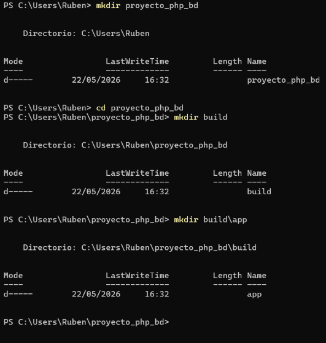

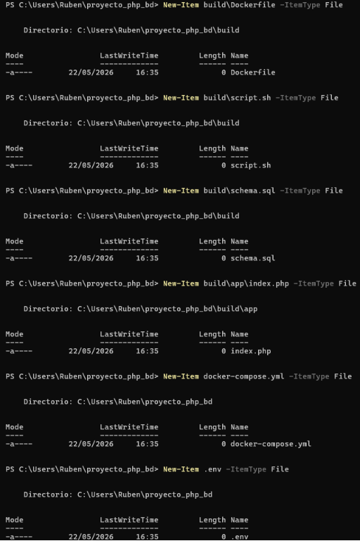

2. Coloca cada archivo proporcionado en su ubicación correspondiente.

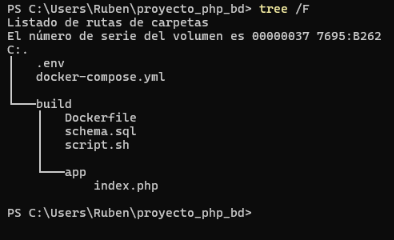

3. Verifica que `script.sh` tiene permisos de ejecución en el host (aunque se configurará en el Dockerfile).

   ---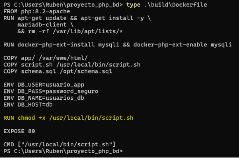

   ### 🔹 Parte 2: Creación del Dockerfile

   #### Tarea 2.1: Diseño del Dockerfile

   Tu Dockerfile debe realizar las siguientes tareas (investiga la sintaxis necesaria):

1. \*\*Imagen base:\*\*
   1. Partir de `php:7.4-apache` o `php:8.2-apache`
1. \*\*Instalación de dependencias:\*\*
- Instalar el cliente de MariaDB (`mariadb-client`)
- Instalar la extensión PHP `mysqli`
- Habilitar la extensión `mysqli`
3. \*\*Copia de archivos:\*\*
- Copiar `app/` al DocumentRoot de Apache
- Copiar `script.sh` a `/usr/local/bin/`
- Copiar `schema.sql` a `/opt/`
4. \*\*Variables de entorno:\*\*
- Definir `DB\_USER` con valor por defecto
- Definir `DB\_PASS` con valor por defecto
- Definir `DB\_NAME` con valor por defecto
- Definir `DB\_HOST` con valor por defecto
5. \*\*Permisos y configuración:\*\*
- Dar permisos de ejecución a `script.sh`
- Exponer el puerto 80
6. \*\*Comando de inicio:\*\*
- Establecer que al iniciar el contenedor se ejecute `script.sh`

FROM php:8.2-apache

RUN apt-get update && apt-get install -y \

`    `mariadb-client \

`    `&& rm -rf /var/lib/apt/lists/\*

RUN docker-php-ext-install mysqli && docker-php-ext-enable mysqli

COPY app/ /var/www/html/

COPY script.sh /usr/local/bin/script.sh

COPY schema.sql /opt/schema.sql

ENV DB\_USER=usuario\_app

ENV DB\_PASS=password\_seguro

ENV DB\_NAME=usuarios\_db

ENV DB\_HOST=db

RUN chmod +x /usr/local/bin/script.sh

EXPOSE 80

CMD ["/usr/local/bin/script.sh"]

\#### Tarea 2.2: Construcción de la imagen

1. Investiga los comandos necesarios para:
- Instalar paquetes en la imagen PHP

Para instalar paquetes se usa el comado apt-get por ejemplo: RUN apt-get update && apt-get install -y 

- Instalar extensiones PHP (consulta la documentación de la imagen oficial) PHP tiene dos tipos de extensiones:

  Tipo Cómo se instala Core (mysqli, pdo, gd, zip, etc.) Con docker-php-ext-install

  PECL (redis, xdebug, mongodb) Con pecl install + docker-php-ext-enable

- Usar `docker-php-ext-install` y `docker-php-ext-enable`

`docker-php-ext-install`:Compila e instala una extensión nativa de PHP en un solo paso. `docker-php-ext-enable`:Activa una extensión que ya está compilada.

2. Construye tu imagen:
- Nombre: `tu\_usuario/app\_php\_bd`
- Etiqueta: `v1`
3. Verifica que la imagen se ha creado y anota su tamaño.

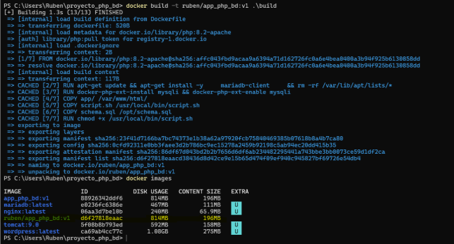

\---

\### 🔹 Parte 3: Despliegue con Docker Compose #### Tarea 3.1: Creación del docker-compose.yml Crea un archivo `docker-compose.yml` que defina:

\*\*Servicio de aplicación PHP (`app`):\*\*

- Tu imagen personalizada
- Puerto 8080 del host → puerto 80 del contenedor
- Variables de entorno para conexión a BD
- Dependencia del servicio de base de datos
- Política de reinicio

\*\*Servicio de base de datos (`db`):\*\*

- Imagen `mariadb`
- Variables de entorno para crear la BD
- Volumen Docker para persistir los datos
- Política de reinicio

\*\*Volumen:\*\*

- Define un volumen Docker para los datos de MariaDB

services:

`  `app:

`    `image: ruben/app\_php\_bd:v1     container\_name: app\_php\_bd     ports:

- "8080:80"

`    `environment:

`      `DB\_HOST: db

`      `DB\_USER: usuario\_app

`      `DB\_PASS: password\_seguro

`      `DB\_NAME: usuarios\_db

`    `depends\_on:

- db

`    `restart: unless-stopped

`  `db:

`    `image: mariadb:latest

`    `container\_name: mariadb\_bd

`    `environment:

`      `MYSQL\_ROOT\_PASSWORD: root\_password\_seguro       MYSQL\_DATABASE: usuarios\_db

`      `MYSQL\_USER: usuario\_app

`      `MYSQL\_PASSWORD: password\_seguro

`    `volumes:

- datos\_mariadb:/var/lib/mysql

`    `restart: unless-stopped

volumes:

datos\_mariadb:

\#### Tarea 3.2: Despliegue y pruebas

1. Despliega el escenario con Docker Compose.

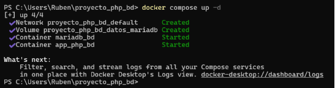

2. Observa los logs de ambos contenedores:
- ¿Aparece el mensaje de "MariaDB está disponible"?

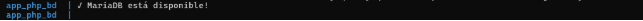

- ¿Se inicializa correctamente la base de datos?Sí. La base de datos sí se inicializa correctamente.

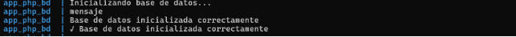

- ¿Hay algún error?

No hay errores 

3. Accede a la aplicación web ([http://localhost:8080](http://localhost:8080/)).
3. Verifica que:
- La conexión a la BD es exitosa
- Se muestran los usuarios de la tabla
- Los datos de conexión son correctos

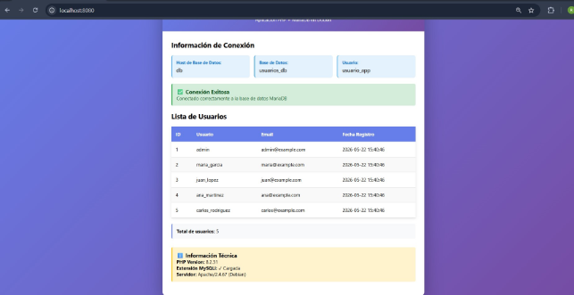

\---

\### 🔹 Parte 4: Configuración y personalización

\#### Tarea 4.1: Modificación de variables de entorno

1. Detén el escenario.

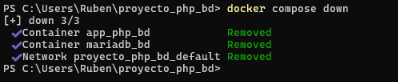

2. Modifica el `docker-compose.yml` para usar diferentes credenciales:
- Cambiar nombre de usuario
- Cambiar contraseña
- Cambiar nombre de la base de datos

  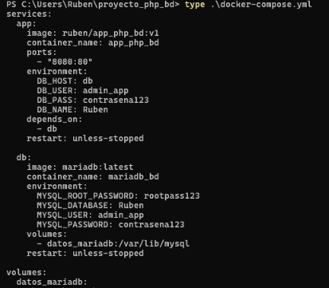

3. Vuelve a desplegar y verifica que funciona con las nuevas credenciales.

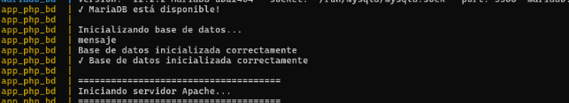

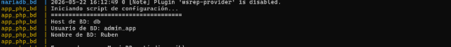

4. \*\*Pregunta:\*\* ¿Qué pasó con los datos anteriores? ¿Por qué? #### Tarea 4.2: Archivo .env
1. Crea un archivo `.env` con todas las variables de configuración:

\```env

- Configuración de la base de datos MYSQL\_ROOT\_PASSWORD=mi\_password\_root\_seguro MYSQL\_DATABASE=usuarios\_db MYSQL\_USER=usuario\_app

  MYSQL\_PASSWORD=password\_seguro

- Configuración de la aplicación\
  APP\_DB\_HOST=db\
  APP\_DB\_USER=usuario\_app\
  APP\_DB\_PASS=password\_seguro\
  APP\_DB\_NAME=usuarios\_db
- Puertos\
  APP\_PORT=8080

\```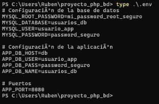

2. Modifica tu `docker-compose.yml` para usar las variables del archivo `.env`.

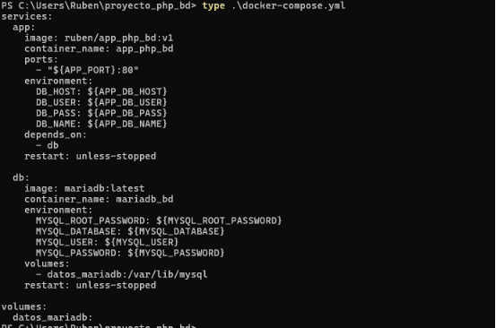

3. Despliega y verifica que funciona correctamente.

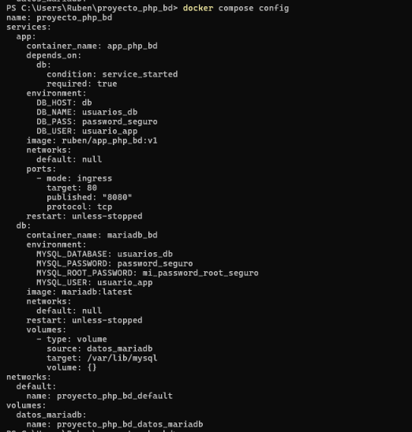

\#### Tarea 4.3: Agregar más datos

1. Accede al contenedor de MariaDB.

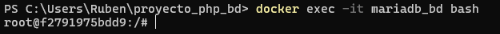

2. Conéctate a la base de datos con el cliente mysql.

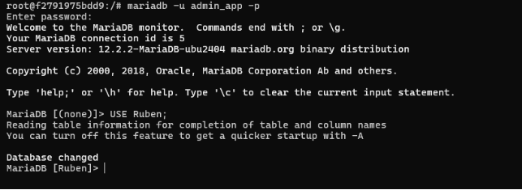

3. Inserta manualmente 3 usuarios adicionales:

\```sql

INSERT INTO users (username, email, password) VALUES ('nuevo\_usuario1', 'nuevo1@example.com', 'pass001'), ('nuevo\_usuario2', 'nuevo2@example.com', 'pass002'), ('nuevo\_usuario3', 'nuevo3@example.com', 'pass003');

\```

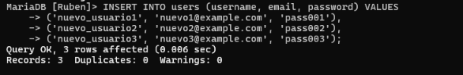

4. Recarga la página web y verifica que aparecen los nuevos usuarios.

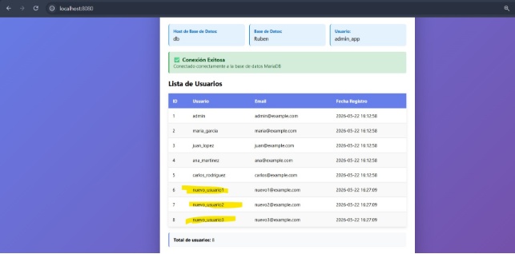

\---

\### 🔹 Parte 5: Persistencia y gestión de datos

\#### Tarea 5.1: Verificación de persistencia

1. Detén todos los contenedores.

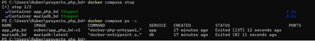

2. Elimina solo los contenedores (manteniendo el volumen).

   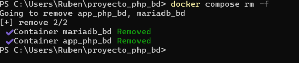

3. Vuelve a desplegar el escenario.

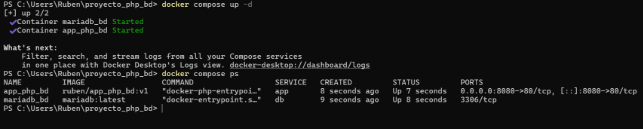

4. Verifica que los datos persisten (incluyendo los usuarios que agregaste manualmente).

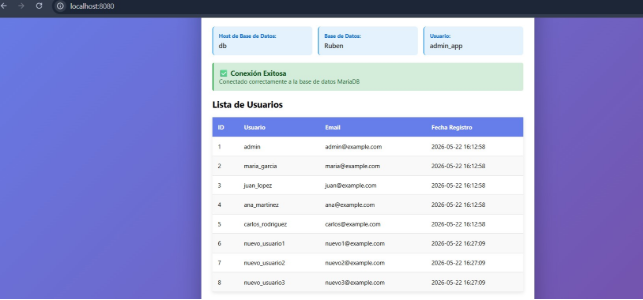

5. \*\*Pregunta:\*\* ¿Por qué los datos insertados desde la web persisten pero el script se ejecuta de nuevo?

   Los datos persisten porque MariaDB guarda la información en un volumen Docker, que no se elimina al recrear los contenedores. 

   #### Tarea 5.2: Reinicio limpio

1. Detén y elimina todo el escenario incluyendo volúmenes.

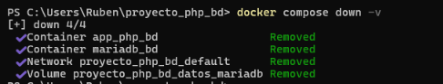

2. Vuelve a desplegarlo.

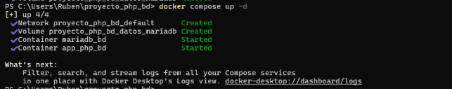

3. Verifica que solo aparecen los 5 usuarios iniciales del `schema.sql`.

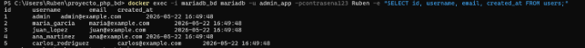

4. Documenta el proceso y explica qué sucedió.

Comandos usados:

- docker compose down -v  # Detiene y elimina contenedores, red y volúmenes; borra los datos de MariaDB
- docker compose up -d  # Vuelve a levantar los contenedores en segundo plano
- docker exec -i mariadb\_bd mariadb -u admin\_app -pcontrasena123 Ruben -e "SELECT id, username, email, created\_at FROM users;"  # Consulta los usuarios existentes en la tabla users

\#### Tarea 5.3: Backup de la base de datos

1. Investiga cómo hacer un backup de una base de datos MySQL/MariaDB dentro de un contenedor Docker.
1. Realiza un backup de tu base de datos a un archivo SQL.
1. Guarda el archivo de backup en el host.

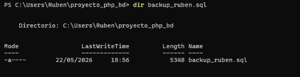

4. Elimina el escenario completo (con volúmenes).

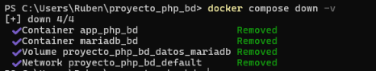

5. Recrea el escenario.

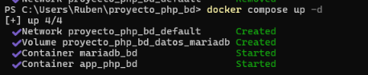

6. Restaura el backup en la nueva base de datos.
6. Verifica que todos los datos se restauraron correctamente.

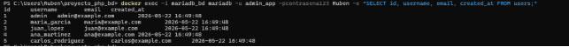

\---

\### 🔹 Parte 6: Mejoras y optimización

\#### Tarea 6.1: Mejora del script de inicialización

Modifica `script.sh` para que:

1. Solo inicialice la base de datos si está vacía (no sobrescribir datos existentes).
1. \*\*Pista:\*\* Puedes verificar si la tabla existe antes de ejecutar el schema.sql:

\```bash

- Verificar si la tabla existe

TABLE\_EXISTS=$(mysql -u "${DB\_USER}" -p"${DB\_PASS}" -h "${DB\_HOST}" "$ {DB\_NAME}" \

`  `-sse "SELECT COUNT(\*) FROM information\_schema.tables WHERE table\_schema='$ {DB\_NAME}' AND table\_name='users';")

if [ "$TABLE\_EXISTS" -eq "0" ]; then

`    `echo "Inicializando base de datos (primera vez)..."

`    `mysql -u "${DB\_USER}" -p"${DB\_PASS}" -h "${DB\_HOST}" "${DB\_NAME}" < /opt/schema.sql

else

`    `echo "Base de datos ya inicializada, omitiendo schema.sql"

fi

\```

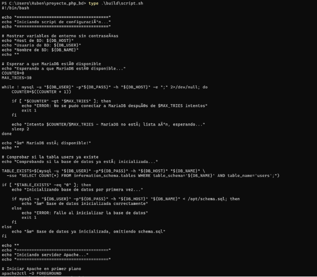

3. Reconstruye la imagen y prueba que funciona correctamente.

   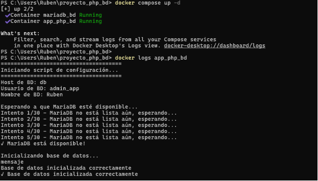

\#### Tarea 6.2: Healthchecks

Añade healthchecks a tu `docker-compose.yml`:

\*\*Para la aplicación PHP:\*\*

- Verificar que el puerto 80 responde
- Intervalo de 30 segundos

\*\*Para MariaDB:\*\*

- Verificar con mysqladmin ping
- Intervalo de 10 segundos

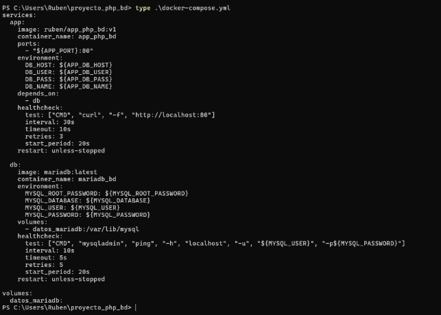

\#### Tarea 6.3: Añadir funcionalidad a la aplicación

Crea un nuevo archivo `build/app/agregar.php` que permita:

1. Mostrar un formulario HTML para agregar usuarios.
1. Procesar el formulario e insertar datos en la BD.
1. Redirigir a index.php después de insertar.

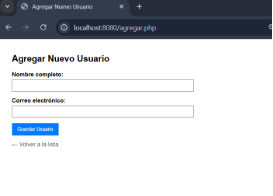

\*\*Requisitos:\*\*

- Validar que los campos no estén vacíos

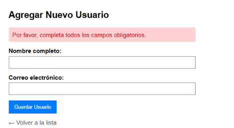

- Validar formato de email

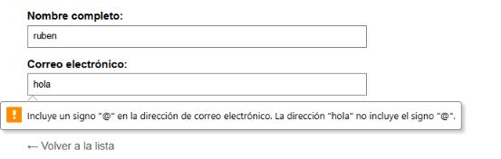

- Mostrar mensajes de error/éxito

---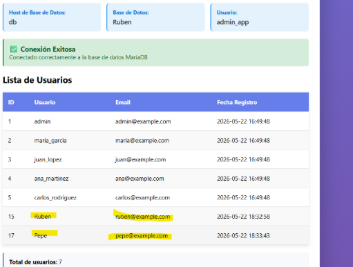

\### 🔹 Parte 7: Análisis y documentación

\#### Tarea 7.1: Preguntas de reflexión

1. \*\*Sobre variables de entorno:\*\*
- ¿Por qué es mejor usar variables de entorno que hardcodear valores?

Porque separa la configuración del código, permitiendo adaptar la aplicación a distintos entornos (desarrollo o producción) sin modificar los archivos. Además, evita que contraseñas sensibles queden expuestas accidentalmente al subir el proyecto a repositorios públicos como GitHub. 

- ¿Qué riesgos de seguridad existen al usar variables de entorno?

Si un atacante logra acceder al servidor, puede leer fácilmente estas variables en texto plano y robar todas las credenciales 

- ¿Cómo mejorarías la seguridad de las credenciales?

Implementaría Docker Secrets que encripta y rota las contraseñas automáticamente.

2. \*\*Sobre el script de inicialización:\*\*
- ¿Por qué necesitamos esperar a que MariaDB esté lista?

Porque el motor de la base de datos tarda unos segundos en inicializar sus archivos internos y abrir el puerto de red. Esperar garantiza que el servicio esté realmente preparado para aceptar conexiones entrantes. 

- ¿Qué pasaría si no esperamos?

La aplicación web intentaría conectarse prematuramente, recibiendo un error de "conexión rechazada" (*Connection refused*). Esto causaría que el contenedor de PHP falle, se detenga o muestre errores críticos en pantalla. 

- ¿Hay alternativas mejores al bucle while?

Si, configurar un *healthcheck* en Docker Compose y usar depends\_on: condition: service\_healthy. 

3. \*\*Sobre la arquitectura:\*\*
- ¿Por qué separar la aplicación y la BD en contenedores diferentes?

Para que cada contenedor haga una sola cosa y la haga bien. 

- ¿Cuáles son las ventajas?

Te da muchísima flexibilidad. Puedes actualizar la versión de PHP sin tocar tus datos, reiniciar solo la web si algo se atasca, o darle más memoria a la base de datos de forma totalmente independiente.

- ¿Cuáles son las desventajas?

Añade un poco más de complejidad al montaje inicial. Te obliga a configurar redes virtuales para que los contenedores hablen entre ellos

4. \*\*Sobre persistencia:\*\*
- ¿Por qué es importante persistir los datos de la BD?

Porque los contenedores son efímeros por naturaleza. Persistir los datos es la única forma de asegurar que la información no desaparezca cada vez que apagas el ordenador o reinicias el sistema. 

- ¿Qué pasa si no usas volúmenes?

Que cada vez que detengas, borres o actualices el contenedor de la base de datos, esta volverá a su estado de fábrica y perderás toda la información que habías guardado en ella. 

- ¿Cuándo usarías volúmenes vs bind mounts?

Usaría *bind mounts* mientras programo para ver los cambios de mi código al instante, y usaría *volúmenes* para la base de datos, ya que Docker los gestiona internamente de forma mucho más rápida y segura. 

\#### Tarea 7.2: Diagrama de la arquitectura

Crea un diagrama que muestre:

1. Los dos contenedores y sus componentes.
1. Las variables de entorno que usa cada uno.
1. El volumen de persistencia.
1. La red que los conecta.
1. Los puertos expuestos.
1. El flujo de datos desde el navegador hasta la BD.

`       `[  Navegador Web (Cliente) ]

`                  `│

`                  `│ 1. Petición HTTP (Puerto 8080)

`                  `▼

┏━━━━━━━━━━━━━━━━━━━━━━━━━━━━━━━━━━━━━━━ ━ ━ ━ ━ ━ ━ ━ ━ ━ ━ ━ ━ ━ ━ ━ ━ ━ ━ ━┓

┃  RED DOCKER INTERNA                                       ┃

┃                                                           ┃

┃   ┌──────────────────────────────────────────────────┐    ┃ ┃   │ CONTENEDOR 1: Aplicación Web (app)               │    ┃

┃   │ • Componentes: Servidor Apache + PHP             │    ┃

┃   │ • Puerto expuesto: 8080 (Mapeado al 80 interno)  │    ┃

┃   │ • Variables (ENV):                               │    ┃

┃   │    - DB\_HOST=db                                  │    ┃

┃   │    - DB\_NAME=usuarios\_db                         │    ┃

┃   │    - DB\_USER=usuario\_app                         │    ┃

┃   │    - DB\_PASS=password                            │    ┃

┃   └───────────────────────┬──────────────────────────┘    ┃ ┃                           │                               ┃

┃                           │ 2. Conexión PDO (Puerto 3306)

┃                           ▼                               ┃

┃   ┌──────────────────────────────────────────────────┐    ┃ ┃   │    CONTENEDOR 2: Base de Datos (db)              │    ┃

┃   │ • Componentes: Motor MariaDB / MySQL             │    ┃

┃   │ • Puerto expuesto: 3306 (Solo en red interna)    │    ┃

┃   │ • Variables (ENV):                               │    ┃

┃   │    - MYSQL\_ROOT\_PASSWORD=root\_pass               │    ┃

┃   │    - MYSQL\_DATABASE=usuarios\_db                  │    ┃

┃   │    - MYSQL\_USER=usuario\_app                      │    ┃

┃   │    - MYSQL\_PASSWORD=password                     │    ┃

┃   └───────────────────────┬──────────────────────────┘    ┃ ┗━━━━━━━━━━━━━━━━━━━━━━━━━━━│ ━━━━━━━━━━━ ━ ━ ━ ━ ━ ━ ━ ━ ━ ━ ━ ━ ━ ━ ━ ━ ━ ━ ━┛

`                            `│ 3. Escritura física

`                            `▼

`             `[  VOLUMEN DOCKER (db\_data) ]

\---

\## Entregables

1\. \*\*Documentación en formato Markdown o PDF\*\* con:

1. Dockerfile completo y comentado
1. Archivo docker-compose.yml completo
1. Script script.sh mejorado (opcional)
1. Archivo .env
1. Todos los comandos utilizados
1. Capturas de pantalla:
   1. Construcción de la imagen
   1. Despliegue con Docker Compose
   1. Aplicación funcionando mostrando usuarios
   1. Logs de inicialización
   1. Healthchecks funcionando
   1. Verificación de persistencia
   1. Backup y restauración
1. Respuestas a todas las preguntas
1. Diagrama de arquitectura
2. \*\*Archivos del proyecto:\*\*
   1. Directorio `build/` completo
   1. Dockerfile
   1. docker-compose.yml
   1. .env
   1. Cualquier mejora adicional (agregar.php, etc.)

\---

\### Evaluación

Se evaluará:

- Correcta construcción de la imagen con extensiones PHP.
- Funcionamiento de la aplicación con la base de datos.
- Uso apropiado de variables de entorno.
- Implementación correcta del script de inicialización.
- Verificación de persistencia de datos.
- Proceso de backup y restauración.
- Comprensión de la arquitectura multi-contenedor.
- Calidad de la documentación.

\---

\### Condiciones de entrega

Las publicadas en la plataforma Moodle del curso. ---

\### Recursos de apoyo

- Imagen oficial de PHP: [https://hub.docker.com/\_/php](https://hub.docker.com/\_/php)
- Extensiones PHP con Docker: [https://github.com/docker-library/docs/blob/master/php/README.md](https://github.com/docker- library/docs/blob/master/php/README.md)
- Imagen oficial de MariaDB: [https://hub.docker.com/\_/mariadb](https://hub.docker.com/\_/mariadb)
- Variables de entorno en Docker Compose: [https://docs.docker.com/compose/environment- variables/](https://docs.docker.com/compose/environment-variables/)
- MySQL/MariaDB en contenedores: [https://dev.mysql.com/doc/refman/8.0/en/docker-mysql- more-topics.html](https://dev.mysql.com/doc/refman/8.0/en/docker-mysql-more-topics.html)

  ---
